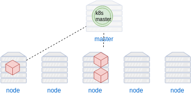

### Deployments


#### Deployments
* A declarative configuration<!-- .element: class="fragment" data-fragment-index="0" -->
* Tell Kubernetes the <!-- .element: class="fragment" data-fragment-index="1" -->_desired state_ of an application 
   + which image(s) to use for an application  <!-- .element: class="img-right" style="width:50%;" -->
   + number of _replicas_ to run
   + network ports
   + volume mounts
* The <!-- .element: class="fragment" data-fragment-index="2" -->_deployment controller_ changes cluster from actual to desired state
Note: On the CLI earlier we relied on default settings, however for more
complicated scenarious we would use files to manage this


#### Maintaining Deployment State
* Kubernetes continuously monitors state of application
* Self-healing 
  + Replace unhealthy instances
  + Redistribute instances if node goes down
* Periodically culls and respawns instances


#### Maintaining Instance Health <!-- .slide: class="image-slide" -->


#### Recovery <!-- .slide: class="image-slide" -->


#### Routine Cull and Respawn Instances <!-- .slide: class="image-slide" -->


#### Managing Deployments
* A _Deployment_ can be modified at any time
  + _scaling_ 
     - changing number of replicas
  + _update_ 
     - change image for all instances 
  + _rollback_
     - roll back to a previous version of application
* Kubernetes replication controller adapts to new desired state


#### Resizing resources
<code>kubectl </code><code style="color:blue;">scale </code><code style="color:red;">RESOURCE</code><code style="color:blue;"> OPTIONS</code>
* Set a new size for a resource<!-- .element: class="fragment" data-fragment-index="0" -->
   + Deployment
   + ReplicaSet
   + Replication Controller
   + StatefulSet 
* Specify preconditions <!-- .element: class="fragment" data-fragment-index="1" -->
   + `--current-replicas`
   + `--resource-version`

<!-- .element: class="stretch"  -->


#### Exercise: Scale number of replicas

* Increase the number of replicas (pods) for the _cat-of-the-day_ application
   <pre class="fragment" data-fragment-index="0"><code data-trim data-noescape>
      kubectl -n cats <mark>scale deployment cat-app</mark> --replicas=4
    </code></pre>
* Query pods <!-- .element: class="fragment" data-fragment-index="1" -->
   ```
   kubectl -n cats get pods
   ```
* Try varying number of replicas up and down<!-- .element: class="fragment" data-fragment-index="2" -->


#### Configuring existing resources
<code>kubectl </code><code style="color:blue;">set </code><code style="color:red;">SUBCOMMAND</code><code style="color:green;"> OPTIONS</code>
* Make changes to existing application resources <!-- .element: class="fragment" data-fragment-index="0" -->
* subcommands: <!-- .element: class="fragment" data-fragment-index="1" -->
   + <!-- .element: class="fragment" data-fragment-index="2" -->**env**: Update environment variables 
   + <!-- .element: class="fragment" data-fragment-index="3" -->**image**: Change image in a particular Pod 
   + <!-- .element: class="fragment" data-fragment-index="4" -->**resources**: Update resource limits on objects with Pod templates
   + <!-- .element: class="fragment" data-fragment-index="5" -->**selector**: Set selector on a resource


#### Exercise: Update _Cat of the Day_
* Update the _cat-app_ application
   <pre class="fragment" data-fragment-index="0"><code data-trim data-noescape>
   kubectl -n cats <mark>set image</mark> deployment/cat-app \
            cat-app=heytrav/cat-of-the-day:v2
  </code></pre>
* Refresh the website periodically <!-- .element: class="fragment" data-fragment-index="1" -->

<!-- .element: class="stretch"  -->


#### Rollout History
* It is easy to look over the revision history of your rollouts <!-- .element: class="fragment" data-fragment-index="1" -->
   ```
   kubectl rollout history deployment/cat-app -n cats
   ```
   ```
    deployments "cat-app"
    REVISION  CHANGE-CAUSE
    1         <none>
    2         <none
   ```
   <!-- .element: class="fragment" data-fragment-index="2" -->


#### Rolling back
* It may be necessary to role an application back to a previous version
   + update or new rollout is stuck <!-- .element: class="fragment" data-fragment-index="0" -->
   + other bugs with application <!-- .element: class="fragment" data-fragment-index="1" -->
* Use <!-- .element: class="fragment" data-fragment-index="2" -->`rollout undo` to roll back to previous version
   + optionally specify revision with `--to-revision=`
    ```
    kubectl -n cats rollout undo deployment/cat-app \
       --to-revision=1
    ```
    <!-- .element: class="fragment" data-fragment-index="3" -->
* Refresh the cat app site <!-- .element: class="fragment" data-fragment-index="4" -->


#### Deployment Spec
For more complicated deployments it is usually preferable to use a _Deployment
Spec_ file.
 
<!-- .element: style="width:40%;float:right;"  -->

<pre  style="width:40%;float:left;font-size:10pt;" ><code data-trim data-noescape>
apiVersion: extensions/v1beta1
kind: Deployment
metadata:
  name: webapp
spec:
  <mark>replicas: 3</mark>
  template:
    metadata:
      labels:
        app: webapp
    spec:
      .
      .
        </code></pre>


#### Deployment Spec
 
<!-- .element: style="width:40%;float:right;"  -->

<pre  style="width:40%;float:left;font-size:10pt;" ><code data-trim data-noescape>
apiVersion: extensions/v1beta1
kind: Deployment
metadata:
  name: webapp
spec:
  replicas: 3
  template:
    metadata:
      labels:
        app: webapp
    spec:
      containers:
        <span class="fragment" data-fragment-index="0">- <mark>image: my-app:v1</mark>
          name: myapp
          volumeMounts:
          - mountPath: /var/www
            name: static-assets</span>
        <span class="fragment" data-fragment-index="1">- <mark>image: nginx:2</mark>
          name: nginx
          ports:
            - containerPort: 80
          volumeMounts:
          - mountPath: /var/www
            name: static-assets</span>
      <span class="fragment" data-fragment-index="2">volumes:
      - name: static-assets
        emptyDir: {}</span> 
        </code></pre>
