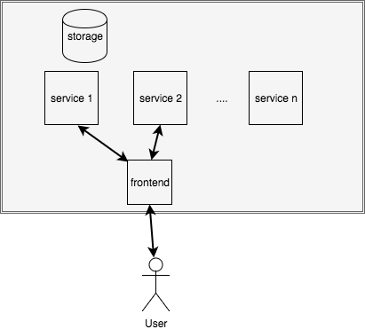

## Docker and Development


### Docker and Microservices
* Containerised applications ideal for microservices <!-- .element: class="fragment" data-fragment-index="0" --> <!-- .element: class="img-right" -->
* Components ideally self contained and modular <!-- .element: class="fragment" data-fragment-index="1" -->
   * deployed independently 
   * scaled independently


### Microservices in Docker
```
 cd ~/docker-introduction/sample-code/mycomposeapp 
```
<!-- .element: class="fragment" data-fragment-index="0" -->
* Let's build a simple application with two components <!-- .element: class="fragment" data-fragment-index="1" -->
   * Web application using Python Flask
   * Redis message queue
* The app is already in mycomposeapp/app.py <!-- .element: class="fragment" data-fragment-index="2" -->
* We want to run the app and redis as separate microservices <!-- .element: class="fragment" data-fragment-index="3" -->
* Redis is already available as a <!-- .element: class="fragment" data-fragment-index="4" -->[docker image](https://hub.docker.com/_/redis/)
   ```
   docker pull redis:alpine
   ```
*  Let's build a docker image for our app <!-- .element: class="fragment" data-fragment-index="5" -->


### Create Our App
* Fire up your favourite editor and create a Dockerfile <!-- .element: class="fragment" data-fragment-index="0" -->
   ```
   gedit Dockerfile
   ```
   <!-- .element: style="font-size:13pt;"  -->
* Contents of <!-- .element: class="fragment" data-fragment-index="1" -->`Dockerfile`
   ```
   FROM python:3.4-alpine
   WORKDIR /code
   COPY requirements.txt /code
   RUN pip install -r requirements.txt
   COPY . /code
   CMD ["python", "app.py"]
   ```
*  Build Docker image for app  <!-- .element: class="fragment" data-fragment-index="2" -->
   ```
   docker build -t web .  
   ```


### First Pass: Creating Microservices

* First let's start our redis container <!-- .element: class="fragment" data-fragment-index="0" -->
   ```
    docker run -d --rm --name redis redis:alpine 
   ```
* For our web container, we need a specific option to connect it to redis
  <!-- .element: class="fragment" data-fragment-index="1" -->
   * `--link <name of container>`
    <pre class="fragment" data-fragment-index="2"><code data-trim
data-noescape>docker run -d --rm --name web <mark>--link redis</mark> -p 5000:5000 web </code></pre>
* Try <!-- .element: class="fragment" data-fragment-index="3" -->`docker ps` to see that _web_ and _redis_ containers are running 
* Once you start the web container go to <!-- .element: class="fragment" data-fragment-index="4" -->[web page](http://localhost:5000) to see counter


### Disadvantages of Command Line Approach

* Complicated with shell/script commands <!-- .element: class="fragment" data-fragment-index="0" -->
   * Managing service interactions
   * Adding/managing services
* Can't scale services <!-- .element: class="fragment" data-fragment-index="1" -->
* Stopping and cleaning up services can be tedious <!-- .element: class="fragment" data-fragment-index="2" -->
   * BTW, you'll need to stop each of those containers
   ```
   $ docker stop web
   $ docker stop redis
   ```
* Better tools exist.. <!-- .element: class="fragment" data-fragment-index="3" -->


### `docker-compose`

* A tool that let's you easily bootstrap complex microservice apps <!-- .element: class="fragment" data-fragment-index="0" -->
* Allows interactive development <!-- .element: class="fragment" data-fragment-index="1" -->
   * you can work on the code while the container is running <!-- .element: class="fragment" data-fragment-index="2" -->
* Can be used for staging/production environments <!-- .element: class="fragment" data-fragment-index="3" -->
* Uses a YAML based config file called the <!-- .element: class="fragment" data-fragment-index="4" -->_docker-compose file_


### The `docker-compose` file
<div style="width:50%;float:left;font-size:19pt;">
<ul>
    <li class="fragment" data-fragment-index="0">
        Service description file
    </li>
    <li  class="fragment"
        data-fragment-index="1">YAML</li>
    <li  class="fragment" data-fragment-index="2">
        By default: <code>docker-compose.yml</code>
    </li>

    <li class="fragment" data-fragment-index="3">Specifies
    <ul>
        <li class="fragment" data-fragment-index="4">Services 
            <ul>
                <li class="fragment" data-fragment-index="5">
                    effectively containers that you
                    will run
                </li>
            </ul>
        </li>
        <li class="fragment" data-fragment-index="6">Volumes 
            <ul>
                <li class="fragment" data-fragment-index="7">
                    filesystem mounts for containers
                </li>
            </ul>
        </li>
        <li class="fragment" data-fragment-index="8">Networks 
            <ul>
                <li class="fragment" data-fragment-index="9">
                    to be created and used by
                    containers
                </li>
            </ul>
        </li>
    </ul>
    </li> 
    <li class="fragment" data-fragment-index="10">
                            Have a look at the <a
                                href="https://docs.docker.com/compose/compose-file/">compose file reference</a>
            </li>
    
</ul>
</div>
<div class="fragment" data-fragment-index="0" style="width:50%;float:left;">

<pre style="font-size:10pt;"><code data-trim
data-noescape>
---
version: "3"
<span class="fragment" data-fragment-index="4"><mark >services:</mark>
  db: 
   image: db
   volumes:
     - data-volume:/var/lib/db
  redis:
    image: redis:alpine
  webapp:
    build: .
    ports:
      - 80:80
    networks:
        hostnet: {}</span>

<span class="fragment" data-fragment-index="6"><mark>volumes:</mark>
  data-volume:</span>

<span class="fragment" data-fragment-index="8"><mark>networks:</mark>
  hostnet:
    external:
      name: host</span>
</code></pre>
</div>


### Services
<div style="width:50%;float:left;font-size:20pt;">
    <ul>
        <li  class="fragment" data-fragment-index="0">
            Each key in <em>services</em> dictionary represents a
            base name for a container
            
        </li>
        <li class="fragment" data-fragment-index="1">
            Attributes of a service include
            <ul>
                <li>
                    build
                    <ul>
                        <li>
                            path or dictionary pointing to Dockerfile to
                            build for container
                        </li>
                    </ul>
                </li>
                <li>
                    image
                    <ul>
                        <li>
                            Use a particular image for container
                        </li>
                    </ul>
                </li>
                <li>
                    ports
                    <ul>
                        <li>
                            expose ports for accessing application
                        </li>
                    </ul>
                </li>
                <li>
                    volumes
                    <ul>
                        <li>
                            mount into container
                        </li>
                    </ul>
                </li>
            </ul>
        </li>

    </ul>
</div>
<div class="fragment" data-fragment-index="0" style="width:50%;float:left;">

                            <pre style="font-size:10pt;"><code data-trim
                            data-noescape>
---
version: "3"
services:

  <mark>webapp</mark>:
    build: .
    ports:
      - 80:80
      - 443:443
    networks:
        hostnet: {}
  <mark>db</mark>: 
   image: db
   volumes:
     - data-volume:/var/lib/db

  <mark>redis</mark>:
    image: redis:alpine
                            </code></pre>
                    
                    </div>


### Interacting with Docker Compose

<code>docker-compose</code> <code style="color:red;">COMMAND</code> <code style="color:blue;">[options]</code> <code>[args]</code>
 
* Use `docker-compose` <code style="color:red;">-h</code> to view inline documentation

|Command |Description|
| --- | --- |
|<code >up</code> |Start compose|      
| <code >down</code> | Stop &amp; tear down containers/networks |
| <code >restart</code> &lt;service name&gt; | Restart a service |


### Exercise: Convert app to `docker-compose`

* In the same directory as previous example <!-- .element: class="fragment" data-fragment-index="0" -->
* Create a file called <!-- .element: class="fragment" data-fragment-index="1" -->`docker-compose.yml`
* Add our service definition: <!-- .element: class="fragment" data-fragment-index="2" -->
   ```
   ---
   version: "3"
   services:
     web: 
       build: .
       ports: 
         - "5000:5000"
     redis:
       image: redis:alpine
   ```
 <!-- .element: style="font-size:10pt;" -->
* Start our microservices <!-- .element: class="fragment" data-fragment-index="3" -->
   ```
   $ docker-compose up [-d]
   ```
                    


### Scaling Services
```
docker-compose up -d --scale SERVICE=<number>
```
* Try scaling the redis service to 4 instances <!-- .element: class="fragment" data-fragment-index="0" -->

<asciinema-player class="fragment" data-fragment-index="1" autoplay="1" loop="loop"  font-size="medium" speed="1"
     theme="solarized-light" src="asciinema/docker-compose-scaling-service.json"
     cols="138" rows="15"></asciinema-player>


### Stopping `docker-compose`

* In the directory where your `docker-compose.yml` file is, run:
   ```
   $ docker-compose stop
   ```


### Summary

* `docker-compose` provides useful way to setup development environments
* Takes care of
   * networking
   * linking containers
   * scaling services
