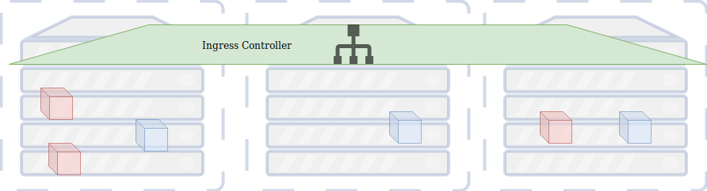
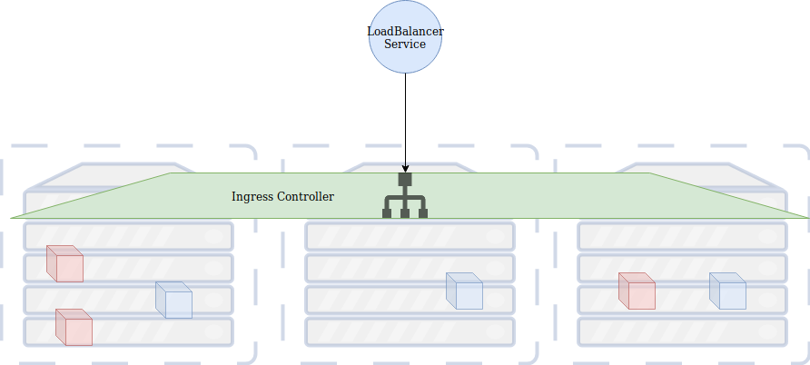
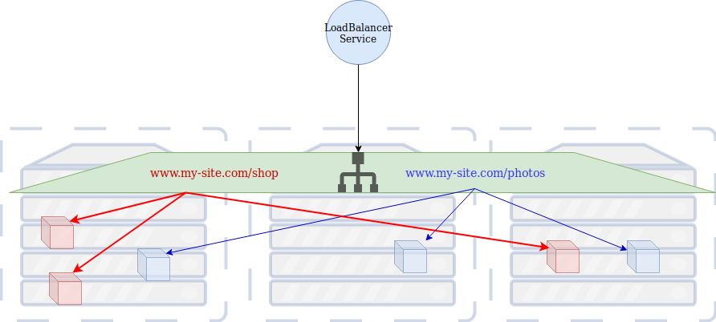
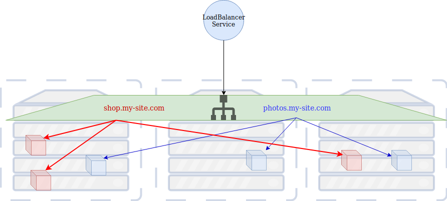

### Ingress Controllers


#### Ingress Controller
* A Kubernetes resource type
* Alternative way to expose workloads in a cluster
* Runs in your cluster and routes traffic to container workloads <!-- .element: class="img-right" -->


#### Setting up Ingress
* <!-- .element: class="fragment" data-fragment-index="0" -->First we need setup Helm and Tiller on your cluster
   ```
   setup-tiller
   ```
* <!-- .element: class="fragment" data-fragment-index="1" -->Use helm to install an ingress controller
   ```
   helm install stable/nginx-ingress --name my-nginx
   ```
   - should generate a bunch of output
* <!-- .element: class="fragment" data-fragment-index="2" -->Watch cluster to
  see when new LB is created
   ```
   kubectl get services -o wide -w my-nginx-nginx-ingress-controller
   ```
* <!-- .element: class="fragment" data-fragment-index="3" -->Note the **EXTERNAL-IP** that is created


#### Ingress and LoadBalancer
* <!-- .element: class="fragment" data-fragment-index="0" -->You still need a LoadBalancer to route traffic to nodes  <!-- .element: class="img-right" width="50%" -->
* <!-- .element: class="fragment" data-fragment-index="1" -->The advantage of Ingress is how it can route traffic to your appliations


#### Ingress routing
##### Path-based routing



#### Exercise: Create our first ingress
* <!-- .element: class="fragment" data-fragment-index="0" -->Let's run the cat app in our cluster
   ```
    kubectl run -n cats cat-app  --port=5000  \
        --image=heytrav/cat-of-the-day:v1
    kubectl -n cats expose deployment cat-app --port=5000
   ```
* <!-- .element: class="fragment" data-fragment-index="1" -->Let's also start an nginx pod and expose it on port 80
   ```
   kubectl -n cats run nginx --image nginx --port 80
   kubectl -n cats expose deployment nginx --port=80
   ```
* <!-- .element: class="fragment" data-fragment-index="2" -->Add **my-cats.com** to `/etc/hosts` with the external IP of your
  loadbalancer
  ```
  xxx.xxx.xxx.xxx   my-cats.com
  ```


#### Expose our ingress using paths
* Put the following in a file called `cats-ingress.yml`
<pre style="font-size:10pt;"><code data-trim data-noescape>
apiVersion: extensions/v1beta1
kind: Ingress
metadata:
  name: cat-ingress
  namespace: cats
  annotations:
    kubernetes.io/ingress.class: nginx
    nginx.ingress.kubernetes.io/rewrite-target: /
spec:
  rules:
    - host: my-cats.com
      http:
        paths:
          - backend:
              serviceName: cat-app
              servicePort: 5000
            path: /cats
          - backend:
              serviceName: nginx
              servicePort: 80
            path: /hello
</code></pre>
* Create the ingress
   ```
   kubectl create -f cats-ingress.yml
   ```


#### Ingress routing
##### sub-domain based routing



#### Define an ingress for vote app
* This can also be done with a spec file
<pre style="font-size:12pt;"><code data-trim data-noescape>
apiVersion: extensions/v1beta1
kind: Ingress
metadata:
  name: vote-ingress
  namespace: vote
  annotations:
    kubernetes.io/ingress.class: nginx
spec:
  rules:
    - host: vote.my-app.com
      http:
        paths:
          - backend:
              serviceName: vote
              servicePort: 80
    - host: result.my-app.com
      http:
        paths:
          - backend:
              serviceName: result
              servicePort: 80
</code></pre>
* Let's do it in the dashboard instead


#### Setup domain-based ingress
* <!-- .element: class="fragment" data-fragment-index="0" -->First, add a couple more hosts to /etc/hosts
  <pre style="font-size:12pt;"><code data-noescape>
  xxx.xxx.xxx.xxx   my-cats.com <mark>vote.my-app.com result.my-app.com</mark>
  </code></pre>
* <!-- .element: class="fragment" data-fragment-index="1" -->In dashboard navigate to the *Loadbalancing* interface and click *Add
  Ingress*
* <!-- .element: class="fragment" data-fragment-index="2" -->Enter a name in the *Name* field and select **vote** from the *Namespace*
  menu
* <!-- .element: class="fragment" data-fragment-index="3" -->Select *Specify a hostname to use* and enter **vote.my-app.com**
* <!-- .element: class="fragment" data-fragment-index="4" -->Leave *path* blank, select **vote** under *Workload* and enter port **80**


#### Setup domain-based ingress
* <!-- .element: class="fragment" data-fragment-index="0" -->Click *Add Rule* and repeat similar steps as above, replacing *vote* with
  *result* where applicable
* <!-- .element: class="fragment" data-fragment-index="1" -->When complete, click *Create*


#### Summary
* Ingress controllers are a versatile alternative to LoadBalancer service
* Can route traffic for multiple sites
  - path-based routing
  - subdomain-based routing
* Can setup SSL traffic as well
