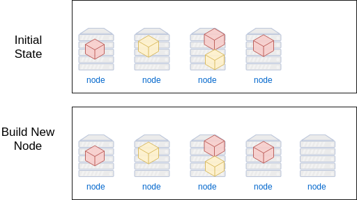
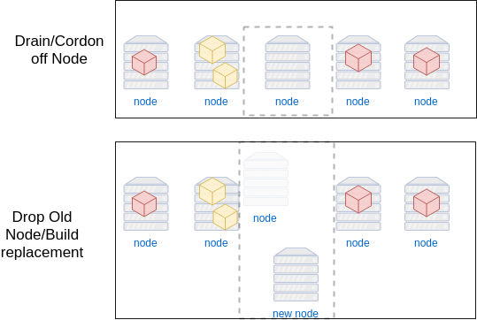
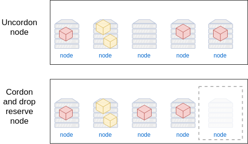

### Maintaining clusters


#### Updating Nodes
* Important to maintain up-to-date stack
* Security updates and patches for underlying OS
* This section explores regular maintenance task on a k8s cluster
* It's good to regularly update machines
* Easiest way is to simply replace VMs on a regular basis


#### Expand and Contract <!-- .slide: class="image-slide" -->



#### Add a new worker
* Edit your cloud inventory
   ```
   vim ~/.ansible/inventory/cloud-hosts
   ```
   <!-- .element: style="font-size:13pt;"  -->
* Add an extra worker
   <pre style="font-size:13pt;"><code class="ini" data-trim data-noescape>
    localhost ansible_connection=local 

    [cluster]
    PREFIX-master
    PREFIX-worker[1:<mark>3</mark>]

    [master]
    PREFIX-master

    [worker]
    PREFIX-worker[1:<mark>3</mark>]
   </code></pre>
* Re run the cluster setup
   ```bash
   ansible-playbook -K create-cluster-hosts.yml kubeadm-install.yml -e prefix=$USERNAME
   ```
   <!-- .element: style="font-size:12pt;"  -->

<!-- .element: class="stretch"  -->


#### Verifying cluster
* New node should be visible in _watch_ terminal
* No containers running on it yet


#### Drain Node <!-- .slide: class="image-slide" -->



#### Draining nodes
<code>kubectl </code><code style="color:blue;">drain</code><code style="color:green;"> OPTIONS</code>
* Tell kubernetes to take a node out of service
* Node is _cordoned_ off
* Pods will be respawned on other machines
* K8s will not restart any Pods until node is _uncordoned_


#### Drain node
* Let's drain worker 2
   ````
   kubectl --server=127.0.0.1:8001 
     drain $USERNAME-worker2 --ignore-daemonsets --delete-local-data
   ```
   <!-- .element: style="font-size:10pt;"  -->
* Watch _watch_ terminal to see how containers are redistributed


#### Remove worker node
* Remove the worker node from our stack
   <pre style="font-size:11pt;"><code data-trim data-noescape>
   ansible-playbook -K <mark>-e node=$USERNAME-worker2 --tags node_only</mark>
        -e prefix=$USERNAME remove-cluster-hosts.yml
</code></pre>


#### Restore new node
* Rerun the playbook for creating the cluster
   ```bash
   ansible-playbook -K create-cluster-hosts.yml kubeadm-install.yml 
      -e prefix=$USERNAME
   ```
   <!-- .element: style="font-size:10pt;"  -->
* This will create a new worker node


#### Uncordon Node <!-- .slide: class="image-slide" -->



#### Adding back a node
<code>kubectl </code><code style="color:blue;">uncordon</code><code style="color:red;"> node</code>
* Uncordon returns or adds a cordoned node back to service
* Let's restore the worker 2 node
   <pre ><code data-trim data-noescape>
    kubectl --server=127.0.0.1:8001 uncordon $USERNAME-worker2 
   </code></pre>
* K8s will not immediately add pods to node
   + culling/respawning
   + scale operations


#### Note about this method
* There are probably cleaner ways to do what we just did
* Probably do a little better with Ansible or other tools
* It was just to illustrate what is _possible_


#### Summary
* Rebuilding nodes on a regular basis essential for security
* K8s provides means for coordinating stack maintenance
* Draining and rebuilding nodes easy to automate
