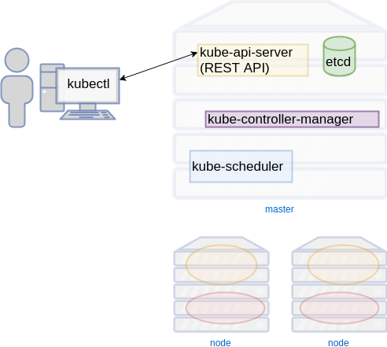
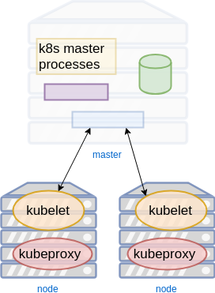

### Controlling Kubernetes


#### Kubernetes Processes on Master
* kubectl
   - client API interface for kubernetes control plane
* api server  <!-- .element: class="img-right"  width="60%"-->
   - REST frontend
+ controller manager
   - replication
   - deployment
+ etcd
   - key/value storage

<!-- .element: style="font-size:19pt;"  -->


#### Kubernetes Processes on Nodes
* kubelet  <!-- .element: class="img-right"  width="50%"-->
   + Makes sure that containers are running in a Pod
* kubeproxy
   + Enables service abstraction; performs connection forwarding


##### `kubectl`
* The client tool for interacting with Kubernetes REST API
* Tons of functionality
* Pronounced:
  + _cube C T L_
  + _cube C D L_
  + _cube cuddle_


#### Configuring `kubectl`
* Configuration file for `kubectl` 
   + `~/.kube/config`
   + pass a configuration file with `--kubeconfig`
* Override via specific CLI options; ie:
   + `--server`
   + `--user`
* `kubectl` currently configured to interact with minikube 


#### Inline documentation
<code>kubectl </code><code style="color:red;">-h</code>
* Use `-h` option to get an overview of commands 
   <pre style="font-size:10;"><code data-trim data-noescape>
   $ kubectl -h  
   kubectl controls the Kubernetes cluster manager. 
   
   Find more information at: https://kubernetes.io/docs/reference/kubectl/overview/
   
   Basic Commands (Beginner):
     create         Create a resource from a file or from stdin.
     expose         Take a replication controller, service, deployment or pod and
</code></pre>   
* Note that they are sorted from _beginner_ to _advanced_

<!-- .element: class="stretch"  -->


#### Command documentation
<code>kubectl </code><code style="color:green;">COMMAND </code><code>-h</code>
* Get usage for any commands

```
$ kubectl run -h
Create and run a particular image, possibly replicated. 

Creates a deployment or job to manage the created container(s).

Examples:
  # Start a single instance of nginx.
  kubectl run nginx --image=nginx
```
<!-- .element: class="fragment" data-fragment-index="0" style="font-size:12pt;" -->


#### Explain resources
<code>kubectl explain </code><code style="color:red;">RESOURCE</code>
* View info about specific kubernetes resources
* See ` kubectl explain -h  ` for list

```
$ kubectl explain ns

KIND:     Namespace
VERSION:  v1

DESCRIPTION:
     Namespace provides a scope for Names. Use of multiple namespaces is
     optional.
```
<!-- .element: class="fragment" data-fragment-index="0" style="font-size:10pt;" -->


#### Gathering information
<code>kubectl </code><code style="color:green;">get </code><code style="color:red;">RESOURCE</code>
* Retrieve information about kubernetes resource
* See ` kubectl get -h ` for list
* Resources can often be abbreviated
   + `kubectl get nodes == kubectl get no`
   + `kubectl get services == kubectl get svc`
* Can fetch multiple at the same time
   + `kubectl get nodes,svc,deploy`
* Or all at once
   + `kubectl get all`


#### Formatting output
* Many `kubectl` commands can output different data formats
  + yaml
  + json
  + custom

```
Usage:
  kubectl get
[(-o|--output=)json|yaml|wide|custom-columns=...|
   custom-columns-file=...|go-template=...|
   go-template-file=...|jsonpath=...|jsonpath-file=...]
```
<!-- .element: class="fragment" data-fragment-index="0" -->


##### Exercise: Get list of nodes
* Output node information in YAML or JSON
   ```
   kubectl get nodes -o yaml
   ```
   <!-- .element: class="fragment" data-fragment-index="0" -->
* At the moment you'll only have one node called <!-- .element: class="fragment" data-fragment-index="1" -->_minikube_


##### Exercise: Process `kubectl` output
* Get a JSON list of node names with corresponding IP
* Helpful to pipe output through tools like *`jq`*
```
kubectl get nodes -o json | jq '.items[] | 
   {name: .metadata.name, ip: (.status.addresses[] 
            | select(.type == "InternalIP")) | .address }'
```
<!-- .element: class="fragment" data-fragment-index="0" style="font-size:13pt;" -->


##### Exercise: Get list of namespaces
* Use `kubectl get ?` to return list of known namespace resources

```bash
$ kubectl get ns
NAME          STATUS    AGE
default       Active    2d
kube-public   Active    2d
kube-system   Active    2d
```
<!-- .element: class="fragment" data-fragment-index="0" -->


##### Exercise: Get list of pods
* Get a list of pods currently running on your cluster
   ```bash
    $ kubectl get pods
    No resources found.
   ```
   <!-- .element: class="fragment" data-fragment-index="0" -->
* If you do not specify a namespace, queries will be against default namespace <!-- .element: class="fragment" data-fragment-index="1" -->
* At present there are no pods running in the default namespace <!-- .element: class="fragment" data-fragment-index="2" -->


#### Querying in a specific namespace
<code>kubectl get </code><code style="color:blue;">-n namespace </code><code style="color:red;">RESOURCE</code>
* Specify a namespace with<!-- .element: class="fragment" data-fragment-index="2" -->*`-n <namespace>`* flag
   ```bash
  $ kubectl -n kube-system get pods
  NAME                                    READY     STATUS    RESTARTS   AGE
  etcd-minikube                           1/1       Running   0          1h
  kube-addon-manager-minikube             1/1       Running   3          2d
  kube-apiserver-minikube                 1/1       Running   0          1h
  kube-controller-manager-minikube        1/1       Running   0          1h
  kube-dns-86f4d74b45-nqx7c               3/3       Running   12         2d
  kube-proxy-z4qqs                        1/1       Running   0          1h
  kube-scheduler-minikube                 1/1       Running   3          2d
  kubernetes-dashboard-5498ccf677-ccvnq   1/1       Running   7          2d
  storage-provisioner                     1/1       Running   8          2d
     ```


#### `kube-system` namespace
* `kube-system` is used for the control plane
* Pods in this namespace are Kubernetes
  + `etcd` (eht-see-dee) simple storage for k8s
  + `kube-apiserver` The API server
  + `kube-controller-manager` and `kube-scheduler`
  + `kube-dns` Manages internal DNS
  + `kube-proxy` (on each machines) manages port mappings


#### Running a Pod
* In Kubernetes we do not run <!-- .element: class="fragment" data-fragment-index="0" -->_containers_
* Run a <!-- .element: class="fragment" data-fragment-index="1" -->_pod_ with one or more _containers_
* Let's run a <!-- .element: class="fragment" data-fragment-index="2" -->_ping_ command against Cloudflare's public DNS resolver
   ```
   kubectl run pingpong --image alpine ping 1.1.1.1
   deployment.apps "pingpong" created
   ```
* So, what is happening? <!-- .element: class="fragment" data-fragment-index="3" -->


#### Viewing resources
<asciinema-player autoplay="1" loop="1" font-size="medium" speed="1"
    theme="solarized-light" src="asciinema/basic-kubectl-get.cast" rows="15" ></asciinema-player>

| Resource Type | Identifier |
|---   | --- |
|Deployment | `deployment.apps/pingpong` |
|Replica Set | `replicaset.apps/pingpong-abcdef1234` |
| Pod | `pod/pingpong-abcde12345` |


#### View logs for a pod
* The `logs` command behaves the same as with `docker logs`
* Accepts either:
   + pod name
      ```
      kubectl logs pingpong-abcde1234
      ```
   + type/name
   ```
   kubectl logs deploy/pingpong
   ```

|Option  | Description |
|--- | --- |
| -f, --follow | stream logs similar to `tail -f` |
| --tail <integer> | Specify how many lines from end to start with |
| --since | Get logs after a timestamp |


#### Watching pods
* The `-w` option to kubectl is like the `watch` command
   ```
   kubectl get pods -w
   ```
* In another window run the following:
   ```
   kubectl delete deploy/pingpong
   ```


#### Scheduling Pods

<code style="font-size:15pt;">kubectl run </code><code style="font-size:15pt;color:blue;">--schedule="\*/5 \* \* \* \* " ...</code>

* The <!-- .element: class="fragment" data-fragment-index="0" -->`--schedule=` option takes a cron-like time pattern
* Creates a type of pod that runs periodically at assigned times <!-- .element: class="fragment" data-fragment-index="1" -->
* In other words, a cronjob <!-- .element: class="fragment" data-fragment-index="2" -->

```
kubectl run pi --schedule="0/5 * * * ?" --image=perl 
   --restart=OnFailure -- 
       perl -Mbignum=bpi -wle 'print bpi(2000)'
```
<!-- .element: class="fragment" data-fragment-index="3" -->

This pod calculates the value of PI to 2000 places every 5 minutes <!-- .element: class="fragment" data-fragment-index="4" -->
