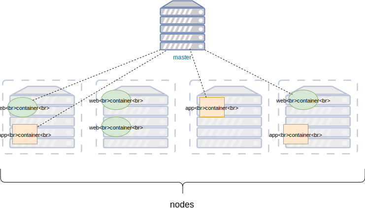
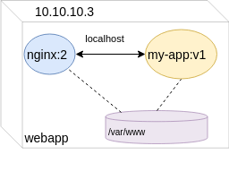
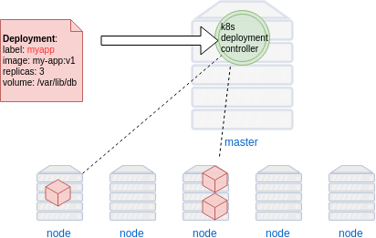
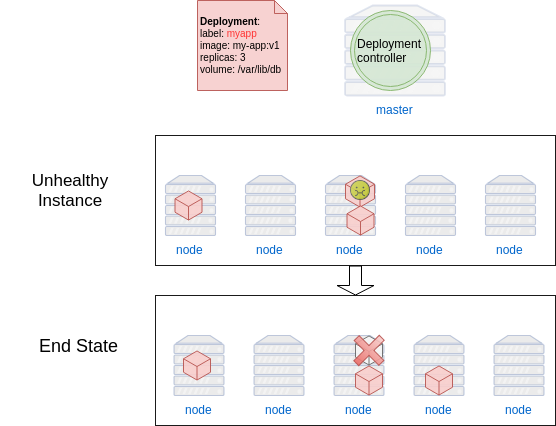
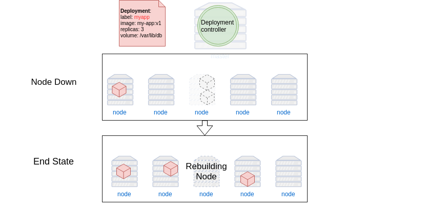
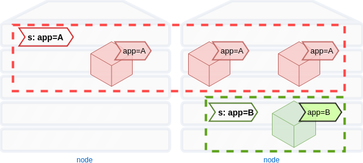
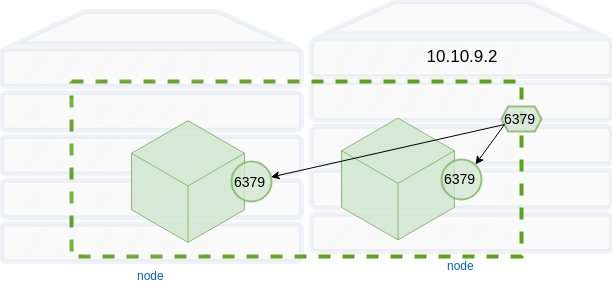

### Kubernetes Resources


#### Kubernetes Concepts
* Nodes
* Pod
* Deployment
* Namespaces
* Services
* Labels and Selectors


#### Nodes
* Nodes are where your containerised workloads will run<!-- .element: class="img-right" width="50%" -->
* No upper limit on number of nodes in a Kubernetes cluster <!-- .element: class="fragment" data-fragment-index="0" -->
* Let's have a look at our <!-- .element: class="fragment" data-fragment-index="1" -->_minikube_ instance


#### Gathering information
<code>kubectl </code><code style="color:green;">get </code><code style="color:red;">RESOURCE</code>
* Retrieve information about kubernetes resources <!-- .element: class="fragment" data-fragment-index="0" -->
    + eg. _nodes_


##### Exercise: Using `kubectl get`
* Use `kubectl get` to get info about current nodes
   ```
   kubectl get nodes

   NAME       STATUS    ROLES     AGE       VERSION
   minikube   Ready     master    6d        v1.10.0
   ```
   <!-- .element: class="fragment" data-fragment-index="0" -->
* We currently only have one node named <!-- .element: class="fragment" data-fragment-index="1" -->_minikube_


#### Formatting output
* Many `kubectl` commands can output different data formats
  + yaml
  + json
* Pass `-o FORMAT` to command

```
Usage:
  kubectl get [(-o|--output=)json|yaml|wide|custom-columns=...|
   custom-columns-file=...|go-template=...|
   go-template-file=...|jsonpath=...|jsonpath-file=...]
```
<!-- .element: class="fragment" data-fragment-index="0" -->


##### Exercise: Get formatted data about nodes
* Output node information in JSON
   ```
   $ kubectl get nodes -o json
   ```
   ```json
   {
    "apiVersion": "v1",
    "items": [
        {
            "apiVersion": "v1",
            "kind": "Node",
            "metadata": {
                "annotations": {
                    "node.alpha.
                    "volumes.kub
   ```
   <!-- .element: class="fragment" data-fragment-index="0" -->
* Quite a bit more information to process <!-- .element: class="fragment" data-fragment-index="1" -->


##### Exercise: Process `kubectl` output
* It can be useful to pipe formatted output through other tools <!-- .element: class="fragment" data-fragment-index="0" -->
* Get a JSON list of node names with corresponding IP <!-- .element: class="fragment" data-fragment-index="1" -->
* jq is handy for processing <!-- .element: class="fragment" data-fragment-index="2" -->output
```
kubectl get nodes -o json | jq '.items[] | 
   {name: .metadata.name, ip: (.status.addresses[] 
            | select(.type == "InternalIP")) | .address }'
```
<!-- .element: class="fragment" data-fragment-index="0" style="font-size:13pt;" -->


#### Running Containerised Workloads
<code style="font-size:16pt;">kubectl run </code><code style="color:red;font-size:16pt;">name </code><code style="color:red;font-size:16pt;">--image=IMAGE:TAG</code><code style="color:green;font-size:16pt;"> OPTIONS</code>
* Create and run jobs in Kubernetes
* Example<!-- .element: class="fragment" data-fragment-index="0" -->:
   ```
   $ kubectl run nginx --image=nginx 
   ```
* Use get command to find out about container <!-- .element: class="fragment" data-fragment-index="1" -->
   ```
   $ kubectl get container
   ```
   ```
   error: the server doesn't have a resource type "container"
   ```
   <!-- .element: class="fragment" data-fragment-index="2" -->
* Container isn't actually a resource type in Kubernetes <!-- .element: class="fragment" data-fragment-index="3" -->


#### Pods
* Technically you do not run  <!-- .element: class="fragment" data-fragment-index="0" -->_containers_ in Kubernetes
* The atomic <!-- .element: class="fragment" data-fragment-index="1" -->_run unit_ of Kubernetes is called a *_Pod_* 
* An abstraction representing group <!-- .element: class="fragment" data-fragment-index="2" -->of ≥ 1 containers
   - images <!-- .element: class="img-right" style="width:50%;" -->
   - network ports
   - volumes


#### Pods
* Containers in a Pod share common resources   
   - Network IP address  <!-- .element: class="img-right" -->
   - Mounted volumes
   - Always co-located and co-scheduled
* Containers within a Pod communicate via _localhost_
Note: For this lesson we'll be using 1 container pods so the distinction isn't
that important. It is still good to be aware of the terminology


##### Exercise: Gather info about pods
* Use `kubectl get` to find info about running pods
   ```
   $ kubectl get pods
   ```
   ```
   NAME                     READY     STATUS    RESTARTS   AGE
   nginx-65899c769f-ttt2x   1/1       Running   0          1h
   ```
   <!-- .element: class="fragment" data-fragment-index="0" style="font-size:13pt;" -->
* We get even more information using <!-- .element: class="fragment" data-fragment-index="1" -->_all_

    ```
    kubectl get all
    ```
   <!-- .element: class="fragment" data-fragment-index="1"  -->
   <pre class="fragment" data-fragment-index="2" style="font-size:13pt;"><code data-trim data-noescape>
    NAME                         READY     STATUS              RESTARTS   AGE
    <mark>pod/nginx-65899c769f-28r95</mark>   1/1       ContainerCreating   0          4s

    NAME                 TYPE        CLUSTER-IP   EXTERNAL-IP   PORT(S)   AGE
    service/kubernetes   ClusterIP   10.96.0.1    <none>        443/TCP   6d

    NAME                    DESIRED   CURRENT   UP-TO-DATE   AVAILABLE   AGE
    <mark>deployment.apps/nginx</mark>   1         1         1            0           4s

    NAME                               DESIRED   CURRENT   READY     AGE
    <mark>replicaset.apps/nginx-65899c769f</mark>   1         1         0         4s
   </code></pre>    


#### Deployments
* A declarative configuration<!-- .element: class="fragment" data-fragment-index="0" -->
* Tell Kubernetes the <!-- .element: class="fragment" data-fragment-index="1" -->_desired state_ of an application 
   + which image(s) to use for an application  <!-- .element: class="img-right" style="width:50%;" -->
   + number of _replicas_ to run
   + network ports
   + volume mounts
* The <!-- .element: class="fragment" data-fragment-index="2" -->_deployment controller_ changes cluster from actual to desired state
Note: On the CLI earlier we relied on default settings, however for more
complicated scenarious we would use files to manage this


#### Maintaining Deployment State
* K8s continuously monitors state of application
* Self-healing 
  + Replace unhealthy instances
  + Redistribute instances if node goes down
* Periodically culls and respawns instances


#### Maintaining Instance Health <!-- .slide: class="image-slide" -->



#### Recovery <!-- .slide: class="image-slide" -->



#### Routine Cull and Respawn Instances <!-- .slide: class="image-slide" -->


#### Managing Deployments
* A _Deployment_ can be modified at any time
  + _scaling_ 
     - changing number of replicas
  + _update_ 
     - change image for all instances 
  + _rollback_
     - roll back to a previous version of application
* Kubernetes replication controller adapts to new desired state


#### Deployment Spec
 
<!-- .element: style="width:40%;float:right;"  -->

<pre  style="width:40%;float:left;font-size:10pt;" ><code data-trim data-noescape>
apiVersion: extensions/v1beta1
kind: Deployment
metadata:
  name: webapp
spec:
  <mark>replicas: 3</mark>
  template:
    metadata:
      labels:
        app: webapp
    spec:
      .
      .
        </code></pre>


#### Deployment Spec
 
<!-- .element: style="width:40%;float:right;"  -->

<pre  style="width:40%;float:left;font-size:10pt;" ><code data-trim data-noescape>
apiVersion: extensions/v1beta1
kind: Deployment
metadata:
  name: webapp
spec:
  replicas: 3
  template:
    metadata:
      labels:
        app: webapp
    spec:
      containers:
        <span class="fragment" data-fragment-index="0">- <mark>image: my-app:v1</mark>
          name: myapp
          volumeMounts:
          - mountPath: /var/www
            name: static-assets</span>
        <span class="fragment" data-fragment-index="1">- <mark>image: nginx:2</mark>
          name: nginx
          ports:
            - containerPort: 80
          volumeMounts:
          - mountPath: /var/www
            name: static-assets</span>
      <span class="fragment" data-fragment-index="2">volumes:
      - name: static-assets
        emptyDir: {}</span> 
        </code></pre>


#### Container Networking
* Each Pod in k8s has its own IP<!-- .element: class="fragment" data-fragment-index="0" -->  <!-- .element: class="img-right" -->
   + even on same node
* Pod IPs never exposed outside cluster <!-- .element: class="fragment" data-fragment-index="1" -->
* Pod IPs change often <!-- .element: class="fragment" data-fragment-index="2" -->
   + updates/rollbacks
   + routine health maintenance
* Need a way to reliably map traffic to Pods <!-- .element: class="fragment" data-fragment-index="3" -->


#### Services
* A service defines logical set of pods and policy to access them <!-- .element: class="fragment" data-fragment-index="3" --> <!-- .element: class="img-right" -->
* Ensure Pods for a specific Deployment receive network traffic <!-- .element: class="fragment" data-fragment-index="4" -->


#### Labels & Selectors
* Labels are key/values assigned to objects
   + Pods
* Labels can be used in a variety of ways:  <!-- .element: class="img-right" -->
   + Classify object
   + versioning
   + designate as production, staging, etc.


#### Matching Services and Pods
* Labels provide means for _services_ to route traffic to groups of pods
* Services route traffic to Pods with certain label using _Selectors_  <!-- .element: class="img-right" -->


#### Service types
* _ClusterIP_
   - Exposes the Service on an internal IP in the cluster
* _NodePort_
   - Expose port on each node in cluster


#### ClusterIP
_ClusterIP_ services are only visible within a cluster
 
<!-- .element: style="width:40%;float:right;"  -->

<pre style="width:40%;float:left;"><code data-trim data-noescape>
apiVersion: v1
kind: Service
metadata:
  name: redis
spec:
  <span class="fragment" data-fragment-index="1"><mark>type: ClusterIP</mark></span>
  <span class="fragment" data-fragment-index="2">ports:
  - port: 6379
    targetPort: 6379</span>
  <span class="fragment" data-fragment-index="3">selector:
    <mark>app: redis</mark></span></code></pre>


#### NodePort
_NodePort_ services exposed on each node of cluster
 
<!-- .element: style="width:50%;float:right;"  -->

<pre style="width:40%;float:left;"><code data-trim data-noescape>
apiVersion: v1
kind: Service
metadata:
  name: nginx
spec:
  name: "web-service"
  <mark>type: NodePort</mark>
  ports:
  - port: 80
    targetPort: 5000
    <mark>nodePort: 31000</mark>
  selector:
    app: app</code></pre>


##### Other Service Types
* _LoadBalancer_
   - Creates LB on cloud (if supported)
* _ExternalName_ 
   - Expose service using name by returning CNAME


### Connecting an Application
* Functioning application depends on <!-- .element: class="img-right" style="width:50%;" -->
   + Deployment
   + Pods
   + Services
   + Labels, selectors


### Namespaces
* A way to partition a k8s cluster for different applications
* Virtual cluster  <!-- .element: class="img-right" -->
* Isolate set of containers on same physical cluster
