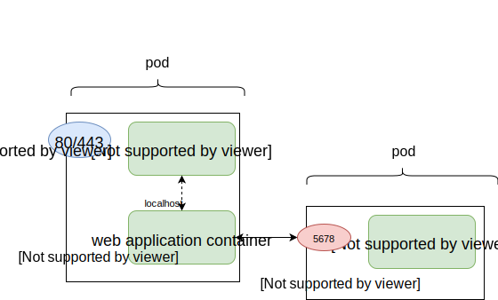
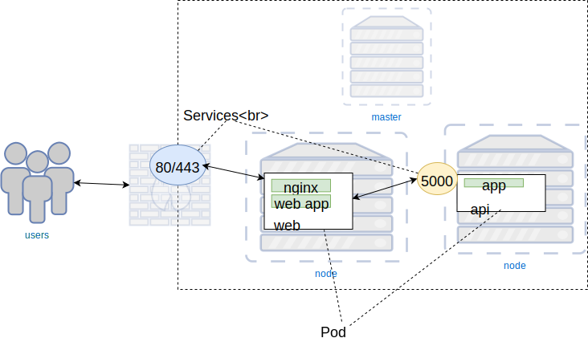
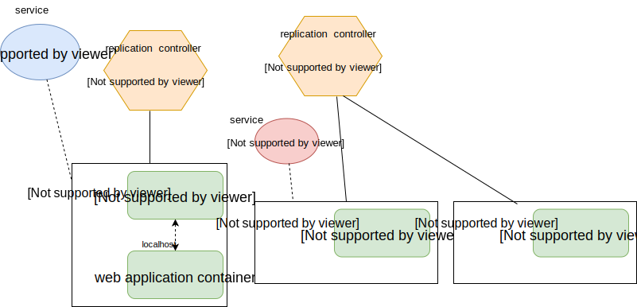
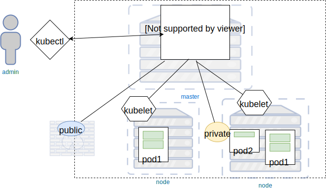

## Kubernetes


### Kubernetes Facts

* Greek word for _helmsman_ or _pilot_
* Also origin of words like _cybernetics_ and _government_
* Inspired by _Borg_, Google's internal scheduling tool
* Play on _Borg cube_
* [Source](https://news.ycombinator.com/item?id=9653797)


### Kubernetes Concepts
* Host types
   + master
      - performs _scheduling_
      - monitoring/healthchecks
   + node (formerly _minion_)
      - runs containers


### Pods
* A _pod_ is the unit of work 
   + Consist of ≥ 1 containers  <!-- .element: class="img-right" style="width:50%;" -->
      - Always _scheduled_ together
      - Have same IP
      - Communication via localhost


### Deployments

* Provides declarative updates for Pods
* Describe _desired state_ of an object and controller changes state at a
  controlled rate
* Functions
   + Create pods
   + Declare new state of pods
   + Scale deployment
   + Rollback to an earlier deployment revision


### Services
* Exposes IP of Pod to  <!-- .element: class="img-right" style="width:50%;" -->
    + Other Pods
    + External ports (i.e. web, API ingress)


### Labels & Selectors
* Label is a key: value pair used to group objects
    - replication controllers for scheduling pods
    - services 
* Label Selectors 
   + Select objects base on labels
   + Semantics:
      - `role = webserver` 
      - `app != foo`, 
      - `role in (webserver, backend)`


### Namespaces
* Virtual cluster
* Isolate set of containers on same physical cluster


### Kubernetes Labels & Deployments <!-- .slide: class="image-slide" -->
 


### Defining a Service
* Service spec defines
  + Type <!-- .element: class="fragment" data-fragment-index="0" -->
     - <!-- .element: class="fragment" data-fragment-index="1" -->`NodePort | ClusterIP`
  + Ports & protocol <!-- .element: class="fragment" data-fragment-index="2" -->
  + Map to Replication Controller (Pod) <!-- .element: class="fragment" data-fragment-index="3" -->

<!-- .element: style="width:50%;float:left;"  -->

<pre style="width:40%;float:left;"><code data-trim data-noescape>
apiVersion: v1
kind: Service
metadata:
  name: redis
spec:
  <span class="fragment" data-fragment-index="1"><mark>type: ClusterIP</mark></span>
  <span class="fragment" data-fragment-index="2">ports:
  - port: 6379
    targetPort: 6379</span>
  <span class="fragment" data-fragment-index="3">selector:
    <mark>app: redis</mark></span></code></pre>


### Defining a Deployment
* Specification deployment file
* Attributes define <!-- .element: class="fragment" data-fragment-index="0" -->
   + How many instances to run at start<!-- .element: class="fragment" data-fragment-index="1" -->
   + Label selectors <!-- .element: class="fragment" data-fragment-index="1" -->
   + Images/containers in pod <!-- .element: class="fragment" data-fragment-index="2" -->
   + Volumes mounted in pod <!-- .element: class="fragment" data-fragment-index="3" -->

<!-- .element: style="width:50%;float:left;"  -->

<pre  style="width:40%;float:left;font-size:10pt;" ><code data-trim data-noescape>
<span class="fragment" data-fragment-index="0">apiVersion: extensions/v1beta1
kind: Deployment
metadata:
  name: redis</span>
<span class="fragment" data-fragment-index="1">spec:
  <span class="fragment" data-fragment-index="1"><mark>replicas: 1</mark></span>
  template:
    metadata:
      labels:
        <mark>app: redis</mark></span>
    <span class="fragment" data-fragment-index="2">spec:
      containers:
      - <mark>image: redis:alpine</mark>
        name: redis
        volumeMounts:
        - mountPath: /data
          name: redis-data</span>
      <span class="fragment" data-fragment-index="3">volumes:
      - name: redis-data
        emptyDir: {}</span> 
        </code></pre>


### Controlling Kubernetes
* Control plane of Kubernetes is a REST API  <!-- .element: class="img-right" style="width:60%;"  -->
* Admin cluster using `kubectl` command line client


### Demo: Set up Voting Application in Kubernetes


### Setup
* Steps needed:
   + Create host machines in the cloud
   + Set up networking
   + Install Kubernetes dependencies
      - kubectl
      - kubeadm
      - kubelet
   + Join nodes to master
   + Deploy Kubernetes spec files


### Create Hosts File
```
cd docker-introduction/ansible
ansible-playbook local-setup.yml -e prefix=<username>
```


### Create Kubernetes Cluster

```
ansible-playbook -K -i cloud-hosts \
   create-cluster-hosts.yml kubeadm-install.yml -e prefix=<username>
```


### Setting up the Voting Application
* Have a look in the `example-voting-app/k8s-specifications`


### Remotely Controlling Kubernetes
* Start kubectl proxy locally
   ```
   kubectl --kubeconfig ~/k8s-admin.conf proxy
   Starting to serve on 127.0.0.1:8001
   ```
* Put this terminal aside and open a new one


### Verify Kubernetes Cluster
```
kubectl --server=127.0.0.1:8001 get nodes
NAME               STATUS    ROLES     AGE       VERSION
trainingpc-master   Ready     master    26m       v1.10.2
trainingpc-worker1  Ready     <none>    25m       v1.10.2
trainingpc-worker2  Ready     <none>    25m       v1.10.2
```


### Create Namespace
* Create a namespace for our application

```
kubectl  --server=127.0.0.1:8001 create namespace vote
namespace "vote" created
```


### Watch cluster
* In another terminal, run the following

```
watch -t -n1 'echo Vote Pods \
   && kubectl --server=127.0.0.1:8001 get pods -n vote -o wide \
   && echo && echo vote Services \
   && kubectl --server=127.0.0.1:8001 get svc -n vote \
   && echo && echo vote Deployments \
   && kubectl --server=127.0.0.1:8001 get deployments -n vote \
   && echo && echo Nodes \
   && kubectl --server=127.0.0.1:8001 get nodes -o wide'
```


### Load Specification Files

* The `apply` command loads a specification into kubernetes
   ```
   kubectl apply <file> 
   ```
* The entire vote app is specified in yaml files
```bash
cd ~/example-voting-app/k8s-specifications
for i in `ls *.yaml`; \
     do kubectl --server=127.0.0.1:8001 apply -n vote -f $i; done
```
<!-- .element: style="font-size:12pt;"  -->

* This tells kubernetes to begin setting up containers
  + creates network endpoints
  + assigns Pods to replication controller
* When you run this, go back to the _watcher_ terminal


### View Website
* Once all containers are running you can visit your website
* You first need to find a couple ports:
   <pre><code data-trim data-noescape>
	vote Services
	NAME      TYPE        CLUSTER-IP       ...   PORT(S)          AGE
	db        ClusterIP   10.108.228.228   ...   5432/TCP         3h
	redis     ClusterIP   10.107.101.100   ...   6379/TCP         3h
	result    NodePort    10.107.43.36     ...   5001:<mark>31001/TCP</mark>   3h
	vote      NodePort    10.104.244.69    ...   5000:<mark>31000/TCP</mark>   3h
</code></pre> <!-- .element: style="font-size:13pt;" -->
* Navigate to the [voting app](http://voting:appl:31000). You may need to
  change the port


### Scaling 

* Orchestration platforms make it easy to scale your app up/down
   + Simply increase or decrease the number of containers
* Let's increase the number of vote containers
   ```
   kubectl --server=127.0.0.1:8001 -n vote scale deployment vote --replicas=9
   ```
   <!-- .element: style="font-size:13pt;" -->
* Play with the scaled number; keep an eye on _watcher_ terminal 


###  Updating Our Application
* Update the _vote_ application with your image
   ```
   kubectl --server=127.0.0.1:8001  \
        -n vote set image deployment/vote \
            vote=YOURNAME/vote:v1
   ```
* Watch the _watcher_ terminal
* Refresh the site several times while update is running


### Kubernetes Dashboard
* Kubernetes provides a dashboard for monitoring purposes
   ```
   kubectl --server=127.0.0.1:8001 -n kube-system apply -f \
       https://raw.githubusercontent.com/kubernetes/dashboard/master/src/deploy/recommended/kubernetes-dashboard.yaml
   ```
* Once you've activated it, go to the [dashboard page](http://127.0.0.1:8001/api/v1/namespaces/kube-system/services/https:kubernetes-dashboard:/proxy/)


### Clean up

```
ansible-playbook ansible/remove-cluster-hosts.yml -K -e prefix=<username>
```
