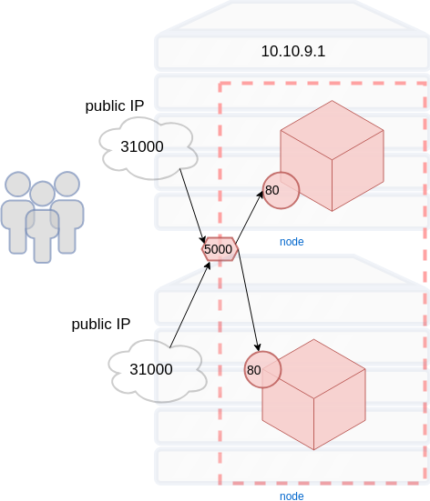

### Kubernetes


#### Kubernetes Facts

* Greek word for _helmsman_ or _pilot_
* Also origin of words like _cybernetics_ and _government_
* Inspired by _Borg_, Google's internal scheduling tool
* Play on _Borg cube_
* [Source](https://news.ycombinator.com/item?id=9653797)


#### Kubernetes Host Types
* master
   - performs _scheduling_
   - monitoring/healthchecks
* node (formerly _minion_)
   - runs containers


#### Kubernetes Concepts
* Deployment
* Pod
* Services
* Labels and Selectors
* Namespaces


#### Running applications in Kubernetes
* A declarative configuration called a <!-- .element: class="fragment" data-fragment-index="0" -->_Deployment_
* Tell Kubernetes the <!-- .element: class="fragment" data-fragment-index="1" -->_desired state_ of an application 
   + which image(s) to use for an application  <!-- .element: class="img-right" style="width:50%;" -->
   + number of _replicas_ to run
   + network ports
   + volume mounts
* The <!-- .element: class="fragment" data-fragment-index="2" -->_deployment controller_ changes cluster from actual to desired state


#### Creating a Deployment
<code style="font-size:14pt;">kubectl run </code><code style="color:red;font-size:14pt;">name </code><code style="color:red;font-size:14pt;">--image=IMAGE:TAG</code><code style="color:green;font-size:14pt;"> OPTIONS</code>
* Simplest way to create a deployment in Kubernetes <!-- .element: class="fragment" data-fragment-index="0" -->
   + `kubectl run` command
   ```
   kubectl run nginx --image=nginx --replicas=3
   ```
* CLI options <!-- .element: class="fragment" data-fragment-index="1" --> <!-- .element: class="img-right" -->
   + _name_ for the deployment
   + an image
   + other info (i.e. replicas, ports, volumes)


#### Maintaining Deployment State
* K8s continuously monitors state of application
* Self-healing 
  + Replace unhealthy instances
  + Redistribute instances if node goes down
* Periodically culls and respawns instances


#### Maintaining State of a Deployment <!-- .slide: class="image-slide" -->
 <!-- .element: class="fragment" data-fragment-index="0" -->


#### Managing Deployments
* A _Deployment_ can be modified at any time
  + _scaling_ 
     - changing number of replicas
  + _update_ 
     - change image for all instances 
  + _rollback_
     - roll back to a previous version of application
* Kubernetes replication controller adapts to new desired state


#### Pods
* From <!-- .element: class="fragment" data-fragment-index="1" -->_Deployment_ Kubernetes creates _Pods_
* Atomic <!-- .element: class="fragment" data-fragment-index="2" -->_run unit_ of K8s (not containers)
* An abstraction representing group <!-- .element: class="fragment" data-fragment-index="3" -->of ≥ 1 containers
   - images <!-- .element: class="img-right" style="width:50%;" -->
   - network ports
   - volumes


#### Pods
* Containers in a Pod share common <!-- .element: class="fragment" data-fragment-index="0" -->resources   
   - Network IP address  <!-- .element: class="img-right" -->
   - Mounted volumes
   - Always co-located and co-scheduled
* Containers within a Pod communicate via <!-- .element: class="fragment" data-fragment-index="1" -->_localhost_
* Deployments defined with a <!-- .element: class="fragment" data-fragment-index="2" -->_Deployment Spec_
   - typically yaml or json file <!-- .element: class="fragment" data-fragment-index="3" -->
   - number of replicas <!-- .element: class="fragment" data-fragment-index="4" -->
   - how containers are run <!-- .element: class="fragment" data-fragment-index="5" -->


#### Deployment Spec
 
<!-- .element: style="width:40%;float:right;"  -->

<pre  style="width:40%;float:left;font-size:10pt;" ><code data-trim data-noescape>
apiVersion: extensions/v1beta1
kind: Deployment
metadata:
  name: webapp
spec:
  <mark>replicas: 3</mark>
  template:
    metadata:
      labels:
        app: webapp
    spec:
      .
      .
        </code></pre>


#### Deployment Spec
 
<!-- .element: style="width:40%;float:right;"  -->

<pre  style="width:40%;float:left;font-size:10pt;" ><code data-trim data-noescape>
apiVersion: extensions/v1beta1
kind: Deployment
metadata:
  name: webapp
spec:
  replicas: 3
  template:
    metadata:
      labels:
        app: webapp
    spec:
      containers:
        <span class="fragment" data-fragment-index="0">- <mark>image: my-app:v1</mark>
          name: myapp
          volumeMounts:
          - mountPath: /var/www
            name: static-assets</span>
        <span class="fragment" data-fragment-index="1">- <mark>image: nginx:2</mark>
          name: nginx
          ports:
            - containerPort: 80
          volumeMounts:
          - mountPath: /var/www
            name: static-assets</span>
      <span class="fragment" data-fragment-index="2">volumes:
      - name: static-assets
        emptyDir: {}</span> 
        </code></pre>


#### Container Networking
* Each Pod in k8s has its own IP<!-- .element: class="fragment" data-fragment-index="0" -->  <!-- .element: class="img-right" -->
   + even on same node
* Pod IPs never exposed outside cluster <!-- .element: class="fragment" data-fragment-index="1" -->
* Pod IPs change often <!-- .element: class="fragment" data-fragment-index="2" -->
   + updates/rollbacks
   + routine health maintenance
* Need a way to reliably map traffic to Pods <!-- .element: class="fragment" data-fragment-index="3" -->


#### Services
* A service defines logical set of pods and policy to access them <!-- .element: class="fragment" data-fragment-index="3" --> <!-- .element: class="img-right" -->
* Ensure Pods for a specific Deployment receive network traffic <!-- .element: class="fragment" data-fragment-index="4" -->


#### Labels & Selectors
* Labels are key/values assigned to objects
   + Pods
* Labels can be used in a variety of ways:  <!-- .element: class="img-right" -->
   + Classify object
   + versioning
   + designate as production, staging, etc.


#### Matching Services and Pods
* Labels provide means for _services_ to route traffic to groups of pods
* Services route traffic to Pods with certain label using _Selectors_  <!-- .element: class="img-right" -->


#### Service types
* _ClusterIP_
   - Exposes the Service on an internal IP in the cluster
* _NodePort_
   - Expose port on each node in cluster


#### ClusterIP
_ClusterIP_ services are only visible within a cluster
 
<!-- .element: style="width:40%;float:right;"  -->

<pre style="width:40%;float:left;"><code data-trim data-noescape>
apiVersion: v1
kind: Service
metadata:
  name: redis
spec:
  <span class="fragment" data-fragment-index="1"><mark>type: ClusterIP</mark></span>
  <span class="fragment" data-fragment-index="2">ports:
  - port: 6379
    targetPort: 6379</span>
  <span class="fragment" data-fragment-index="3">selector:
    <mark>app: redis</mark></span></code></pre>


#### NodePort
_NodePort_ services exposed on each node of cluster
 
<!-- .element: style="width:50%;float:right;"  -->

<pre style="width:40%;float:left;"><code data-trim data-noescape>
apiVersion: v1
kind: Service
metadata:
  name: nginx
spec:
  name: "web-service"
  <mark>type: NodePort</mark>
  ports:
  - port: 80
    targetPort: 5000
    <mark>nodePort: 31000</mark>
  selector:
    app: app</code></pre>


##### Other Service Types
* _LoadBalancer_
   - Creates LB on cloud (if supported)
* _ExternalName_ 
   - Expose service using name by returning CNAME


### Connecting an Application
* Functioning application depends on <!-- .element: class="img-right" style="width:50%;" -->
   + Deployment
   + Pods
   + Services
   + Labels, selectors


### Namespaces
* A way to partition a k8s cluster for different applications
* Virtual cluster  <!-- .element: class="img-right" -->
* Isolate set of containers on same physical cluster
