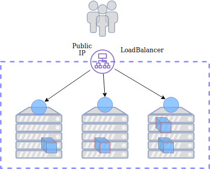

### LoadBalancer Service


#### Problems with NodePort
* <!-- .element: class="fragment" data-fragment-index="0" -->Using a NodePort service is ok for test purposes
* <!-- .element: class="fragment" data-fragment-index="1" -->Not practical for an actual website:
  - eg. visit my website at [http://202.49.243.126:31000](http://202.49.243.126:31000)
* <!-- .element: class="fragment" data-fragment-index="2" -->Prefer to use 
  - fixed domain
  - standard ports (i.e. 80, 443)


#### LoadBalancer Service
 
* LoadBalancer Service is actually combination of
  - NodePort (>31000) on each node
  - Load balancer set up by your cloud provider


#### LoadBalancer Service
* <!-- .element: class="fragment" data-fragment-index="0" -->Let's create a load balancer service for the *vote* app
<pre><code data-noescape data-trim>
    kind: Service
    apiVersion: v1
    metadata:
      name: loadbalanced-service
    spec:
      selector:
        <mark>app: vote</mark>
      type: LoadBalancer
      ports:
      - name: http
        port: 80
        protocol: TCP
</code></pre>
* <!-- .element: class="fragment" data-fragment-index="1" -->Save this as `loadbalancer.yml`
* <!-- .element: class="fragment" data-fragment-index="2" -->Apply with kubectl
   ```
   kubectl -n vote apply -f loadbalancer.yml
   ```


#### Using a LoadBalancer service
* <!-- .element: class="fragment" data-fragment-index="0" -->Check available services to see when load balancer is ready
   ```
   kubectl -n vote get svc -w
   ```
* <!-- .element: class="fragment" data-fragment-index="1" -->It takes a few minutes while your provider provisions the load balancer
* <!-- .element: class="fragment" data-fragment-index="2" -->Once finished a public IP will appear under EXTERNAL-IP
<pre style="font-size:11pt;"><code data-noescape data-trim>
kubectl -n vote get svc
NAME                   TYPE           CLUSTER-IP       EXTERNAL-IP      PORT(S)
db                     ClusterIP      10.254.70.29     &lt;none&gt;           5432/TCP
loadbalanced-service   LoadBalancer   10.254.167.242   <mark>202.49.243.158</mark>   80:31909/TCP
redis                  ClusterIP      10.254.125.187   &lt;none&gt;           6379/TCP
result                 NodePort       10.254.236.164   &lt;none&gt;           5001:31001/TCP
vote                   NodePort       10.254.234.53    &lt;none&gt;           5000:31000/TCP
</code></pre>


#### Advantages of LoadBalancer
* <!-- .element: class="fragment" data-fragment-index="0" -->With a **LoadBalancer** type service you can now access your website on the new IP on a standard port (eg. 80 or 443)
* <!-- .element: class="fragment" data-fragment-index="1" -->Can setup DNS with your domain name of choice
  - eg. Visit my website [http://my-vote-app.nz](http://www.latlmes.com/arts/return-of-the-golden-age-of-comics-1)


#### Disadvantages of a LoadBalancer
* <!-- .element: class="fragment" data-fragment-index="0" -->We can only expose
  one workload (i.e. Pod/container/whatever)
   - Have a LoadBalancer for *vote* pods
   - Need a separate LoadBalancer for the *result* pods
* <!-- .element: class="fragment" data-fragment-index="1" -->Load balancers are expensive
* <!-- .element: class="fragment" data-fragment-index="2" -->Separate public IP so need a second domain


#### Remove load balancer
* In the next section we'll look at an alternative to using the LoadBalancer
  service
* For now let's delete the load balancer
   ```
   kubectl -n vote delete -f  loadbalancer.yml
   ```
