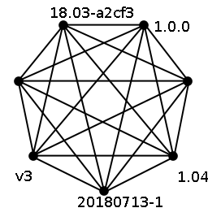
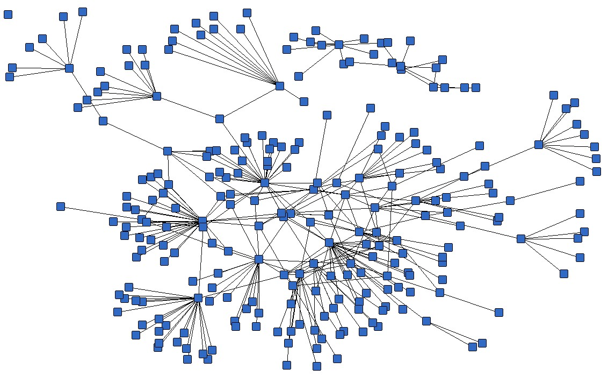

### Microservices

#### Literature about Microservices
* [Microservices](https://www.martinfowler.com/articles/microservices.html): Martin Fowler and James Lewis

#### Typical Monolithic Systems
* Often standard MVC architecture
   + Frontend _view_ HTML, JavaScript
   + Backend _controller_
   + Database _model_
* Typically one large binary to deploy
* Single command to run

#### Disadvantages of Monolith
* Tightly coupled code
   + Smallest change still requires complete release
   + Small change can affect entire application
   + Long release cycles
* Usually single large DB
   + Tight coupling with data model
   + Simple schema change can break app
* Horizontal Scaling
* Rollback of an entire version

#### Microservices
* Application consists of multiple _components_ 
  + A _service_ is fundamental component
* Services are isolated in scope and functionality
   + Lowers impact of change
* Services can be coupled to separate storage backends
   + Reduce impact of schema changes on entire app
+ Can be scaled independently 
+ Smaller memory/CPU fingerprint means faster deployment
Note: A component is a unit that is pluggable and replaceable

#### Disadvantages of Microservices
* Remote calls more expensive
* Services must agree on a protocol  <!-- .element: class="img-right" -->
   + XML (XMLRPC, SOAP)
   + JSON
* Can become complicated to version individual services

#### Managing Microservices
* How do you manage 10 or 100s of microservices?  <!-- .element: class="img-right" -->
