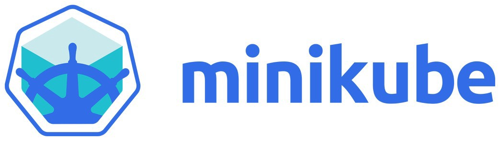
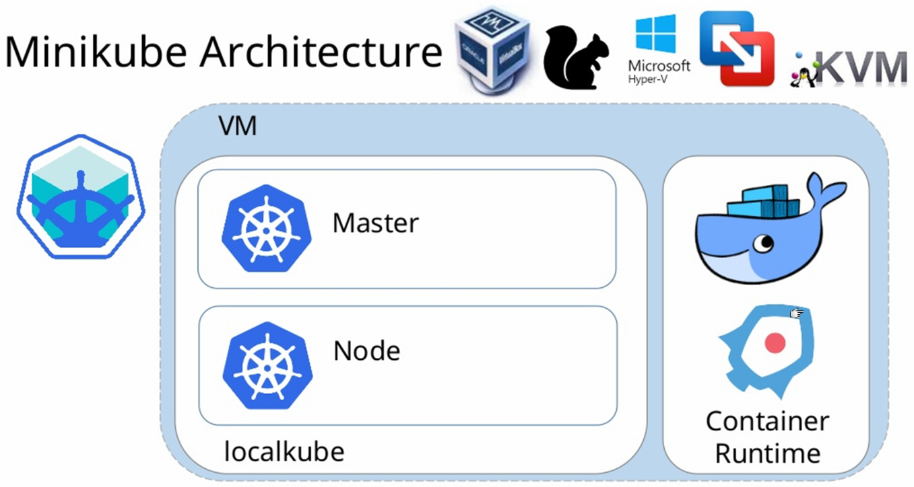

### Kubernetes on your workstation


<!-- .slide: class="image-slide" -->



#### Minikube
* Creates a <!-- .element: class="fragment" data-fragment-index="0" -->_single node_ Kubernetes cluster on your PC
* Useful if you <!-- .element: class="fragment" data-fragment-index="1" -->
   + want to become familiar with Kubernetes concepts <!-- .element: class="fragment" data-fragment-index="2" -->
   + do not have a cluster <!-- .element: class="fragment" data-fragment-index="3" -->
   + are preparing a Kubernetes workshop <!-- .element: class="fragment" data-fragment-index="4" -->


#### What you need to run Minikube
* [minikube binaries](https://kubernetes.io/docs/tasks/tools/install-minikube/)
* A hypervisor
  + [KVM](https://www.linux-kvm.org/page/Main_Page)
  + [virtualbox](https://www.virtualbox.org/wiki/Downloads)
* The training machines should be set up


#### Start Minikube
* Start minikube
   ```
   minikube start
   ```
* This will configure `~/.kube/config` to speak to local cluster
* Download `kubectl` 
   + Instructions in output of previous command


#### Your Minikube Cluster
* You now have a functioning Kubernetes cluster on your workstation 
* Single machine playing both roles
   + master <!-- .element: class="img-right" width="60%"-->
   + node


#### Interacting with minikube
* Find  ip of cluster
   ```
   minikube ip
   ```
* Use `kubectl` to control a minikube cluster
Note: As with any kubernetes cluster


#### Minikube Dashboard
* To view the minikube dashboard
   ```
   minikube dashboard
   ```
