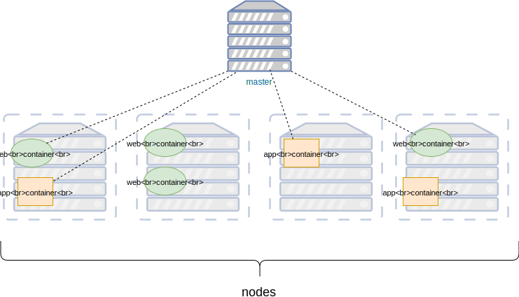
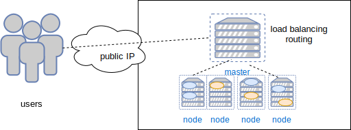
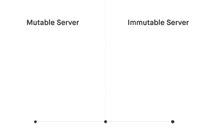

### Orchestration

#### Orchestration to the rescue
* Monitors health of services
   + Cull unhealthy services
   + Periodically spawn new services
* React to change in demand (autoscaling)
* Manage networking between services

#### Container Orchestration
* Primary means of deploying containerised applications to production <!-- .element: class="fragment" data-fragment-index="0" -->
* Provides tools for managing containers across a cluster <!-- .element: class="fragment" data-fragment-index="1" -->
   + networking
   + scaling
   + monitoring
* Ideal for deploying containerised applications in production <!-- .element: class="fragment" data-fragment-index="2" -->

#### Server Architecture

* Machine designated the <!-- .element: class="fragment" data-fragment-index="0" -->_master_  or _manager_
* Several machines designated <!-- .element: class="fragment" data-fragment-index="1" -->_workers_ or _nodes_ 

 <!-- .element: class="fragment" data-fragment-index="3" -->

#### Container Orchestration: User perspective
* Orchestration framework handles 
   + Routing requests to containers  <!-- .element: class="img-right" -->
   + Load balancing between different containers
* From user perspective as if interacting with single appliation

#### Masters and Nodes
* The <!-- .element: class="fragment" data-fragment-index="3" -->_master_  is reponsible for
   + scheduling containers to run across all <!-- .element: class="fragment" data-fragment-index="4" -->_nodes_
   + managing the network interaction between nodes <!-- .element: class="fragment" data-fragment-index="5" -->
   + monitoring container health <!-- .element: class="fragment" data-fragment-index="6" -->
   + periodically kill/respawn containers <!-- .element: class="fragment" data-fragment-index="7" -->
* The <!-- .element: class="fragment" data-fragment-index="8" -->_nodes_ or _workers_
   + Just run the containers

#### Container Lifecycle 
* Containers are ephemeral
* The job of the _master_ is to make sure containers are healthy
* It will periodically kill and respawn a container
* This is very similar to _phoenix_ principle  <!-- .element: class="img-right" -->
   + Outdated or unhealthy containers <!-- .element: class="fragment" data-fragment-index="0" -->_burned_
   + Fresh containers spawned in their place <!-- .element: class="fragment" data-fragment-index="1" -->

#### Orchestration Platforms

* Vendor
    + AWS ECS
    + Azure container services
    + Google GKE (based on Kubernetes)
* Docker Swarm
   + Integrated into Docker since 17.03
* Kubernetes
   + Descends from _Borg_, (Google)
   + Can use other container platforms than Docker (eg. rkt)
