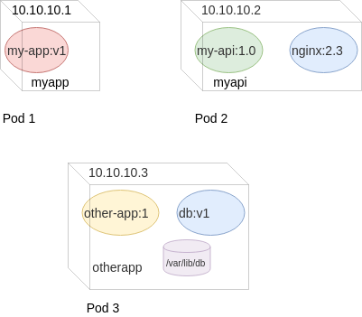

### Running Workloads in Kubernetes


#### Running Containerised Workloads
<code style="font-size:16pt;">kubectl run </code><code style="color:red;font-size:16pt;">name </code><code style="color:red;font-size:16pt;">--image=IMAGE:TAG</code><code style="color:green;font-size:16pt;"> OPTIONS</code>
* Create and run jobs in Kubernetes
* Example<!-- .element: class="fragment" data-fragment-index="0" -->:
   ```
   $ kubectl run nginx --image=nginx 
   ```
* Use get command to find out about container <!-- .element: class="fragment" data-fragment-index="1" -->
   ```
   $ kubectl get container
   ```
   ```
   error: the server doesn't have a resource type "container"
   ```
   <!-- .element: class="fragment" data-fragment-index="2" -->
* Container isn't actually a resource type in Kubernetes <!-- .element: class="fragment" data-fragment-index="3" -->


#### Pods
* Technically you do not run  <!-- .element: class="fragment" data-fragment-index="0" -->_containers_ in Kubernetes
* The atomic <!-- .element: class="fragment" data-fragment-index="1" -->_run unit_ of Kubernetes is called a *_Pod_* 
* A Pod is an abstraction representing group <!-- .element: class="fragment" data-fragment-index="2" -->of ≥ 1 containers
   - images <!-- .element: class="img-right" style="width:50%;" -->
   - network ports
   - volumes
* In this lesson we'll be using single container pods <!-- .element: class="fragment" data-fragment-index="3" -->


#### Pods
* Containers in a Pod share common resources   
   - Network IP address  <!-- .element: class="img-right" -->
   - Mounted volumes
   - Always co-located and co-scheduled
* Containers within a Pod communicate via _localhost_
Note: For this lesson we'll be using 1 container pods so the distinction isn't
that important. It is still good to be aware of the terminology


##### Exercise: Gather info about pods
* Use `kubectl get` to find info about running pods
   ```
   $ kubectl get pods
   ```
   ```
   NAME                     READY     STATUS    RESTARTS   AGE
   nginx-65899c769f-ttt2x   1/1       Running   0          1h
   ```
   <!-- .element: class="fragment" data-fragment-index="0" style="font-size:13pt;" -->
* We get even more information using <!-- .element: class="fragment" data-fragment-index="1" -->_all_

    ```
    kubectl get all
    ```
   <!-- .element: class="fragment" data-fragment-index="1"  -->
   <pre class="fragment" data-fragment-index="2" style="font-size:13pt;"><code data-trim data-noescape>
    NAME                         READY     STATUS              RESTARTS   AGE
    <mark>pod/nginx-65899c769f-28r95</mark>   1/1       ContainerCreating   0          4s

    NAME                 TYPE        CLUSTER-IP   EXTERNAL-IP   PORT(S)   AGE
    service/kubernetes   ClusterIP   10.96.0.1    <none>        443/TCP   6d

    NAME                    DESIRED   CURRENT   UP-TO-DATE   AVAILABLE   AGE
    <mark>deployment.apps/nginx</mark>   1         1         1            0           4s

    NAME                               DESIRED   CURRENT   READY     AGE
    <mark>replicaset.apps/nginx-65899c769f</mark>   1         1         0         4s
   </code></pre>    


#### Running a Pod
* Let's run a <!-- .element: class="fragment" data-fragment-index="1" -->_ping_ command against Cloudflare's public DNS resolver
   ```
   kubectl run pingpong --image alpine ping 1.1.1.1
   deployment.apps "pingpong" created
   ```
* So, what is happening? <!-- .element: class="fragment" data-fragment-index="3" -->


#### Viewing resources
<asciinema-player autoplay="1" loop="1" font-size="medium" speed="1"
    theme="solarized-light" src="asciinema/basic-kubectl-get.cast" rows="15" ></asciinema-player>

| Resource Type | Identifier |
|---   | --- |
|Deployment | `deployment.apps/pingpong` |
|Replica Set | `replicaset.apps/pingpong-abcdef1234` |
| Pod | `pod/pingpong-abcde12345` |


#### View logs for a pod
* The `logs` command behaves the same as with `docker logs`
* Accepts either:
   + pod name
      ```
      kubectl logs pingpong-abcde1234
      ```
   + type/name
   ```
   kubectl logs deploy/pingpong
   ```

|Option  | Description |
|--- | --- |
| -f, --follow | stream logs similar to `tail -f` |
| --tail <integer> | Specify how many lines from end to start with |
| --since | Get logs after a timestamp |


#### Watching pods
* The `-w` option to kubectl is like the `watch` command
   ```
   kubectl get pods -w
   ```
* In another window run the following:
   ```
   kubectl delete deploy/pingpong
   ```


#### Scheduling Pods

<code style="font-size:15pt;">kubectl run </code><code style="font-size:15pt;color:blue;">--schedule="\*/5 \* \* \* \* " ...</code>

* The <!-- .element: class="fragment" data-fragment-index="0" -->`--schedule=` option takes a cron-like time pattern
* Creates a type of pod that runs periodically at assigned times <!-- .element: class="fragment" data-fragment-index="1" -->
* In other words, a cronjob <!-- .element: class="fragment" data-fragment-index="2" -->

```
kubectl run pi --schedule="0/5 * * * ?" --image=perl 
   --restart=OnFailure -- 
       perl -Mbignum=bpi -wle 'print bpi(2000)'
```
<!-- .element: class="fragment" data-fragment-index="3" -->

This pod calculates the value of PI to 2000 places every 5 minutes <!-- .element: class="fragment" data-fragment-index="4" -->


#### Deployments
* A declarative configuration<!-- .element: class="fragment" data-fragment-index="0" -->
* Tell Kubernetes the <!-- .element: class="fragment" data-fragment-index="1" -->_desired state_ of an application 
   + which image(s) to use for an application  <!-- .element: class="img-right" style="width:50%;" -->
   + number of _replicas_ to run
   + network ports
   + volume mounts
* The <!-- .element: class="fragment" data-fragment-index="2" -->_deployment controller_ changes cluster from actual to desired state
Note: On the CLI earlier we relied on default settings, however for more
complicated scenarious we would use files to manage this


#### Maintaining Deployment State
* K8s continuously monitors state of application
* Self-healing 
  + Replace unhealthy instances
  + Redistribute instances if node goes down
* Periodically culls and respawns instances


#### Maintaining Instance Health <!-- .slide: class="image-slide" -->


#### Recovery <!-- .slide: class="image-slide" -->


#### Routine Cull and Respawn Instances <!-- .slide: class="image-slide" -->


#### Managing Deployments
* A _Deployment_ can be modified at any time
  + _scaling_ 
     - changing number of replicas
  + _update_ 
     - change image for all instances 
  + _rollback_
     - roll back to a previous version of application
* Kubernetes replication controller adapts to new desired state


#### Deployment Spec
For more complicated deployments it is usually preferable to use a _Deployment
Spec_ file.
 
<!-- .element: style="width:40%;float:right;"  -->

<pre  style="width:40%;float:left;font-size:10pt;" ><code data-trim data-noescape>
apiVersion: extensions/v1beta1
kind: Deployment
metadata:
  name: webapp
spec:
  <mark>replicas: 3</mark>
  template:
    metadata:
      labels:
        app: webapp
    spec:
      .
      .
        </code></pre>


#### Deployment Spec
 
<!-- .element: style="width:40%;float:right;"  -->

<pre  style="width:40%;float:left;font-size:10pt;" ><code data-trim data-noescape>
apiVersion: extensions/v1beta1
kind: Deployment
metadata:
  name: webapp
spec:
  replicas: 3
  template:
    metadata:
      labels:
        app: webapp
    spec:
      containers:
        <span class="fragment" data-fragment-index="0">- <mark>image: my-app:v1</mark>
          name: myapp
          volumeMounts:
          - mountPath: /var/www
            name: static-assets</span>
        <span class="fragment" data-fragment-index="1">- <mark>image: nginx:2</mark>
          name: nginx
          ports:
            - containerPort: 80
          volumeMounts:
          - mountPath: /var/www
            name: static-assets</span>
      <span class="fragment" data-fragment-index="2">volumes:
      - name: static-assets
        emptyDir: {}</span> 
        </code></pre>
