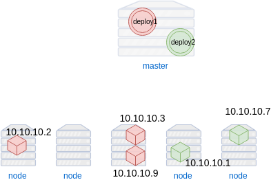
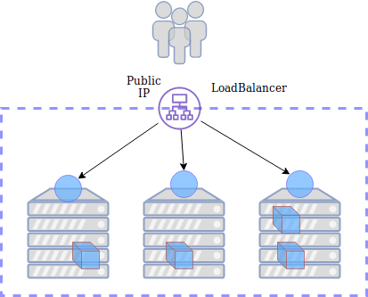

### Services


#### Routing traffic to pods
* Earlier we started an nginx pod
* At the moment there is no way to reach it
   ```
   kubectl get pods -o json | jq '.items[] | {name: .metadata.name, podIP: .status.podIP }'
   ```
   <!-- .element: style="font-size: 9pt;"  -->
* <!-- .element: class="fragment" data-fragment-index="0" -->Response
   ```
   {
     "name": "nginx-b848f798f-clrvd",
     "podIP": "172.17.0.5"
   }
   ```
* The <!-- .element: class="fragment" data-fragment-index="1" -->_podIP_ is not reachable


#### The `expose` command
<code>kubectl expose -h</code>
* Creates a service
* Takes the name (label) of a resource to use as a selector
* Can assign a port on the host to route traffic to our pod


##### Exercise: Expose nginx workload
* Need to create a service which
  + uses name of _nginx_ deployment as selector
  + maps requests to port on nginx pod (port 80)
  + opens a port that is visible on our machine

```
$ kubectl expose deployment nginx --type=NodePort --port=80
```
<!-- .element: class="fragment" data-fragment-index="0" font-size:13pt; -->
```
service/nginx exposed
```
<!-- .element: class="fragment" data-fragment-index="1" font-size:13pt; -->


#### Get list of available services
* Get list of services
   ```
   $ kubectl get services
   ```
   <pre class="fragment" data-fragment-index="0" style="font-size:13pt;"><code data-trim data-noescape>
NAME         TYPE        CLUSTER-IP      EXTERNAL-IP   PORT(S)        AGE
kubernetes   ClusterIP   10.96.0.1       &lt;none&gt;        443/TCP        106m
nginx        NodePort    10.110.58.243   &lt;none&gt;        80:<mark>31812</mark>/TCP   65m
   </code></pre>
* <!-- .element: class="fragment" data-fragment-index="1" -->Note the port that is displayed for the service (will vary)
* Find IP of minikube host <!-- .element: class="fragment" data-fragment-index="2" -->
   ```
   $ minikube ip
   ```
* Application should be exposed on the minikube IP at highlighted port <!-- .element: class="fragment" data-fragment-index="2" -->


#### Networking Pods
* Each Pod in k8s has its own IP<!-- .element: class="fragment" data-fragment-index="0" -->  <!-- .element: class="img-right" -->
   + even on same node
* Pod IPs never exposed outside cluster <!-- .element: class="fragment" data-fragment-index="1" -->
* Pod IPs change often <!-- .element: class="fragment" data-fragment-index="2" -->
   + updates/rollbacks
   + routine health maintenance
* Need a way to reliably map traffic to Pods <!-- .element: class="fragment" data-fragment-index="3" -->


#### Services
* A service defines logical set of pods and policy to access them <!-- .element: class="fragment" data-fragment-index="3" --> <!-- .element: class="img-right" -->
* Ensure Pods for a specific Deployment receive network traffic <!-- .element: class="fragment" data-fragment-index="4" -->


#### Labels & Selectors
* Labels are key/values assigned to objects
   + Pods
* Labels can be used in a variety of ways:  <!-- .element: class="img-right" -->
   + Classify object
   + versioning
   + designate as production, staging, etc.


#### Labels & Selectors
* Earlier we created a pod with label:<!-- .element: class="fragment" data-fragment-index="0" --> <code style="color:green;">name=nginx</code>
   <pre><code data-trim data-noescape>
   kubectl create deployment <mark>nginx</mark> --image=nginx
    </code></pre>
* Then we created a service that maps requests to the selector <!-- .element: class="fragment" data-fragment-index="1" --><code style="color:green;">name=nginx</code>
  <pre ><code data-trim data-noescape>
  kubectl expose deployment <mark>cat-app</mark> --type=NodePort
  </code></pre>


#### Matching Services and Pods
* Labels provide means for _services_ to route traffic to groups of pods
* Services route traffic to Pods with certain label using _Selectors_  <!-- .element: class="img-right" -->


#### Service types
* _ClusterIP_
   - Exposes the Service on an internal IP in the cluster
* _NodePort_
   - Expose port on each node in cluster
* _LoadBalancer_
   - Expose workload through single public IP


#### ClusterIP Service
 Exposes the Service on an internal IP in the cluster 
 


#### NodePort Service
Expose port on each node in cluster
 


#### LoadBalancer Service
Use load balancer to route traffic to service
 
 


#### Service Specification Files
* It is possible to expose a Pod with a Service using <!-- .element: class="fragment" data-fragment-index="0" -->`kubectl expose` command line
* For most applications, common to define <!-- .element: class="fragment" data-fragment-index="1" -->_service specification_ files 
* <!-- .element: class="fragment" data-fragment-index="2" -->A YAML or JSON file that defines a service


#### ClusterIP Spec File
 
<!-- .element: style="width:40%;float:right;"  -->

<pre style="width:40%;float:left;"><code data-trim data-noescape>
apiVersion: v1
kind: Service
metadata:
  name: redis
spec:
  <span class="fragment" data-fragment-index="1"><mark>type: ClusterIP</mark></span>
  <span class="fragment" data-fragment-index="2">ports:
  - port: 6379
    targetPort: 6379</span>
  <span class="fragment" data-fragment-index="3">selector:
    <mark>app: redis</mark></span></code></pre>


#### NodePort Spec File
 
<!-- .element: style="width:50%;float:right;"  -->

<pre style="width:40%;float:left;"><code data-trim data-noescape>
apiVersion: v1
kind: Service
metadata:
  name: nginx
spec:
  name: "web-service"
  <mark>type: NodePort</mark>
  ports:
  - port: 80
    targetPort: 5000
    <mark>nodePort: 31000</mark>
  selector:
    app: app</code></pre>


##### Exercise: View service spec
* <!-- .element: class="fragment" data-fragment-index="0" -->The kubectl
  `get` command can be used to get spec for a service or other objects
* <!-- .element: class="fragment" data-fragment-index="1" -->Use it to view specification for nginx service
   <pre class="fragment" data-fragment-index="2"><code data-trim data-noescape>
   kubectl get svc nginx -o yaml
</code></pre>
* <!-- .element: class="fragment" data-fragment-index="3" -->Output spec to a file
   <pre><code data-trim data-noescape>
   kubectl get svc nginx -o yaml > nginx-service.yml
</code></pre>


##### Exercise: Create service using spec file
* The spec file generated earlier can be used to create a service
* <!-- .element: class="fragment" data-fragment-index="0" -->Delete the
  *nginx* service
  ```
  kubectl delete svc nginx
  ```
* <!-- .element: class="fragment" data-fragment-index="1" -->Create service using file
   ```
   kubectl create -f nginx-service.yml
   ```
* <!-- .element: class="fragment" data-fragment-index="2" -->Check that the
  service is up and the site is funtional
  ```
  kubectl get svc
  ```


##### Exercise: Edit a spec inline
* It's also possible to edit a spec inline 
   ```
   kubectl edit service nginx
   ```
* <!-- .element: class="fragment" data-fragment-index="0" -->This will open up an editor (eg. vim) so you can edit the service
* <!-- .element: class="fragment" data-fragment-index="1" -->Try raising the value for the NodePort
  - Port must be between 30000 and 32767


#### Connecting an Application
* Functioning application depends on <!-- .element: class="img-right" style="width:50%;" -->
   + Deployment
   + Pods
   + Services
   + Labels, selectors
