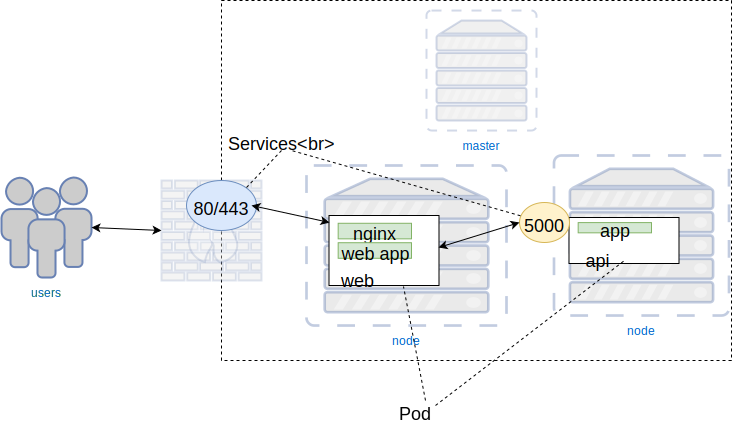

### Services


#### Routing Traffic to Pods
* In the previous section we started a _Cat of the Day_ web application
* At the moment there is no way to reach it
   ```
   $ kubectl -n cats get pods -o json | 
        jq '.items[] | 
         {name: .metadata.name, 
           podIP: .status.podIP }'
   ```
   ```
   {
     "name": "cat-app-b848f798f-clrvd",
     "podIP": "172.17.0.5"
   }
   ```
   <!-- .element: style="font-size:13pt;" class="fragment" data-fragment-index="0"  -->
* The <!-- .element: class="fragment" data-fragment-index="1" -->_podIP_ is not reachable


#### Container Networking
* Each Pod in k8s has its own IP<!-- .element: class="fragment" data-fragment-index="0" -->  <!-- .element: class="img-right" -->
   + even on same node
* Pod IPs never exposed outside cluster <!-- .element: class="fragment" data-fragment-index="1" -->
* Pod IPs change often <!-- .element: class="fragment" data-fragment-index="2" -->
   + updates/rollbacks
   + routine health maintenance
* Need a way to reliably map traffic to Pods <!-- .element: class="fragment" data-fragment-index="3" -->


#### Services
* A service defines logical set of pods and policy to access them <!-- .element: class="fragment" data-fragment-index="3" --> <!-- .element: class="img-right" -->
* Ensure Pods for a specific Deployment receive network traffic <!-- .element: class="fragment" data-fragment-index="4" -->


#### Labels & Selectors
* Labels are key/values assigned to objects
   + Pods
* Labels can be used in a variety of ways:  <!-- .element: class="img-right" -->
   + Classify object
   + versioning
   + designate as production, staging, etc.


#### Matching Services and Pods
* Labels provide means for _services_ to route traffic to groups of pods
* Services route traffic to Pods with certain label using _Selectors_  <!-- .element: class="img-right" -->


#### Service types
* _ClusterIP_
   - Exposes the Service on an internal IP in the cluster
* _NodePort_
   - Expose port on each node in cluster


#### The `expose` command
<code>kubectl expose -h</code>
* Creates a service
* Takes the name (label) of a resource to use as a selector
* Can assign a port on the host to route traffic to our pod


##### Exercise: Expose our _Cat of the Day_ application
* Need to create a service which
  + is in _cats_ namespace
  + uses name of _cat-app_ deployment as selector
  + opens a port that is visible on our machine

```
 kubectl -n cats expose deployment cat-app --type=NodePort
```
<!-- .element: class="fragment" data-fragment-index="0" font-size:13pt; -->


#### Query namespace
* Query the _cats_ namespace
   ```
   kubectl -n cats get svc
   ```
   <pre class="fragment" data-fragment-index="0" style="font-size:13pt;"><code data-trim data-noescape>
    NAME              TYPE       CLUSTER-IP    EXTERNAL-IP   PORT(S)          AGE
    service/cat-app   NodePort   10.107.94.1   &lt;none&gt;        5000:<mark>31355</mark>/TCP   18s
   </code></pre>
* Find IP of minikube host <!-- .element: class="fragment" data-fragment-index="1" -->
   ```
   $ minikube ip
   ```
* Application should be exposed on the minikube IP at highlighted port <!-- .element: class="fragment" data-fragment-index="2" -->


#### Service Specification Files
* As we've seen, it is possible to expose a Pod with a Service using
  `kubectl expose` command line
* For complex applications, probably better to define Service
  Specificatiion files


#### ClusterIP
_ClusterIP_ services are only visible within a cluster
 
<!-- .element: style="width:40%;float:right;"  -->

<pre style="width:40%;float:left;"><code data-trim data-noescape>
apiVersion: v1
kind: Service
metadata:
  name: redis
spec:
  <span class="fragment" data-fragment-index="1"><mark>type: ClusterIP</mark></span>
  <span class="fragment" data-fragment-index="2">ports:
  - port: 6379
    targetPort: 6379</span>
  <span class="fragment" data-fragment-index="3">selector:
    <mark>app: redis</mark></span></code></pre>


#### NodePort
_NodePort_ services exposed on each node of cluster
 
<!-- .element: style="width:50%;float:right;"  -->

<pre style="width:40%;float:left;"><code data-trim data-noescape>
apiVersion: v1
kind: Service
metadata:
  name: nginx
spec:
  name: "web-service"
  <mark>type: NodePort</mark>
  ports:
  - port: 80
    targetPort: 5000
    <mark>nodePort: 31000</mark>
  selector:
    app: app</code></pre>


##### Other Service Types
* _LoadBalancer_
   - Creates LB on cloud (if supported)
* _ExternalName_ 
   - Expose service using name by returning CNAME


### Connecting an Application
* Functioning application depends on <!-- .element: class="img-right" style="width:50%;" -->
   + Deployment
   + Pods
   + Services
   + Labels, selectors
