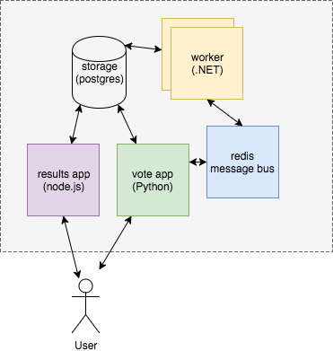

### Sample Microservice Application


#### Building a microservice application
* We're going to build the <!-- .element: class="fragment" data-fragment-index="0" -->[Example Voting App](https://github.com/dockersamples/example-voting-app) tutorial from Docker
* Clone the repository if it's not on your machine already <!-- .element: class="fragment" data-fragment-index="1" -->
   ```
   git clone https://github.com/docker/example-voting-app.git
   ```


#### The Voting Application
* A polyglot application <!-- .element: class="fragment" data-fragment-index="0" -->
* 5 components: <!-- .element: class="fragment" data-fragment-index="1" -->  <!-- .element: class="img-right" -->
    * Python web application <!-- .element: class="fragment" data-fragment-index="2" -->
    * Redis queue <!-- .element: class="fragment" data-fragment-index="3" -->
    * .NET worker <!-- .element: class="fragment" data-fragment-index="4" -->
    * Postgres DB with a data volume <!-- .element: class="fragment" data-fragment-index="5" -->
    * Node.js app to show votes in real time <!-- .element: class="fragment" data-fragment-index="6" -->

<!-- .element: class="stretch" -->


#### Start Application
```
cd ~/example-voting-app
docker-compose up 
```
<asciinema-player autoplay="1" loop="loop"  font-size="medium" speed="1"
    theme="solarized-light" src="asciinema/docker-compose.json" cols="174" rows="10"></asciinema-player>
* This may take some time to download/build images
* Once completed you can [vote](http://localhost:5000) and [view results](http://localhost:5001)
 Note: The default worker app can be a bit flakey. Try using `docker-compose-javaworker.yml` if you have problems.


#### Interactive development

* Open up <code>vote/app.py</code> 
   ```
   vim vote/app.py
   ```
* On lines 8 & 9, modify vote options
* View change in <a href="http://localhost:5000">voting</a> application


#### Change Vote Options
<asciinema-player autoplay="1" loop="loop"  font-size="medium" speed="1" theme="solarized-light" src="asciinema/asciicast-120556.json" cols="138" rows="21"></asciinema-player>


##### Exercise: Package your update into an image

* Tell docker-compose to rebuild the voting app image <!-- .element: class="fragment" data-fragment-index="0" -->
   ```bash
   docker-compose build vote
   ```
   + This will build `examplevotingapp_vote:latest`
* Tag the image<!-- .element: class="fragment" data-fragment-index="1" -->
   ```bash
   docker tag examplevotingapp_vote:latest YOURNAME/vote:v2
   ```
* Push to <!-- .element: class="fragment" data-fragment-index="2" -->[hub.docker.com](https://hub.docker.com)
   ```bash
   docker push YOURNAME/vote:v2
   ```
Note: Hve them repeat everything for the Result nodejs app


##### Exercise: Change Result Display
* Results are rendered in the NodeJS application
* Edit the view template to replace _Cats_ and _Dogs_ with your own options
   ```
   vim ~/example-voting-app/result/views/index.html
   ```
* Repeat previous steps to ship `YOURNAME/result:v2` to DockerHub

<!--<asciinema-player autoplay="1" loop="loop"  font-size="medium" speed="1" theme="solarized-light" src="asciinema/update-nodejs.cast" rows="15" cols="100" ></asciinema-player>-->


#### Developer Workflow

* Push code to repository <!-- .element: class="fragment" data-fragment-index="0" -->
* Continuous Integration (CI) system runs tests <!-- .element: class="fragment" data-fragment-index="1" -->
* If tests successful, automate image build &amp; push to a docker registry <!-- .element: class="fragment" data-fragment-index="2" -->
* Easy to setup Docker build pipelines with existing services <!-- .element: class="fragment" data-fragment-index="3" -->
   * [DockerHub](https://hub.docker.com) 
   * [GitHub](https://github.com)
   * [CircleCI](https://circleci.com)
   * [Quay.io](https://quay.io)


#### Summary

* With docker-compose it's relatively easy to develop on a microservice application
* Changes visible in real time
* Can easily package and distribute images for others to use
